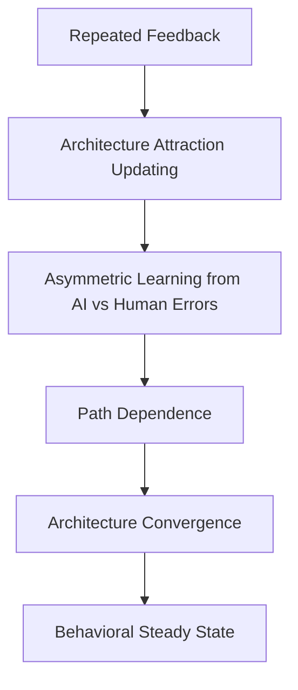
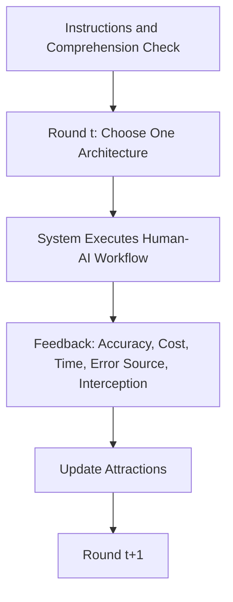
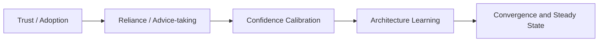
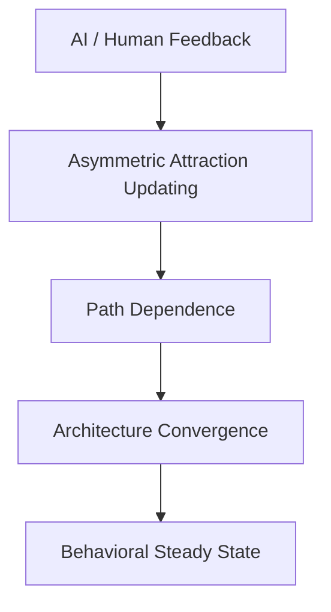
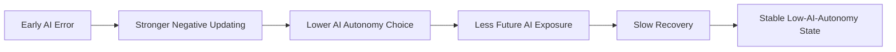

# 多 Agent 研究计划执行稿

## 项目名称

**AI 时代的人机协作架构如何通过经验学习形成？**  
副标题：**AI 错误、路径依赖与人机协作稳定状态**

**英文标题**  
Learning AI's Role: How Humans Converge Toward Stable Human-AI Collaboration Architectures

---

## 总控说明

本稿严格按照你给出的三 Agent 结构组织，不再是单纯整合版，而是显式拆分为：

1. **Agent A：文献与理论架构 Agent**
2. **Agent B：实验设计与模型方法 Agent**
3. **Agent C：整合、可视化与审核 Agent**

每个 Agent 下均包含：

- 任务目标
- 核心工作内容
- 独立产出
- 可直接用于写作或汇报的文本

最后由 Agent C 输出完整 proposal、图示、PPT 大纲与逻辑风险审核。

本项目始终围绕以下主线展开：

> **从 trust/adoption 转向 architecture learning；从短期错误反应转向长期收敛路径；从学习 AI 能力转向学习 AI 角色。**

---

# Agent A：文献与理论架构 Agent

## A1. 任务目标

Agent A 的任务是建立研究问题、文献缺口与理论主线，明确本研究与 trust、advice-taking、confidence calibration、algorithm aversion 等既有文献的边界，并将项目定位为一个关于 **human-AI collaboration architecture learning** 的动态理论研究。

## A2. 核心判断

Agent A 必须守住以下五个边界：

1. 本研究**不是**“人们是否信任 AI”的研究。
2. 本研究**不是**“是否采纳某一次 AI advice”的研究。
3. 本研究**不是**“AI confidence signal 是否被校准”的研究。
4. 本研究**不是** algorithm aversion 的简单重复。
5. 本研究关注的是：**人在持续反馈中如何学习 AI 的系统角色，并最终收敛到稳定的人机协作架构。**

## A3. 文献矩阵

| 文献流派 | 代表文献 | 核心问题 | 核心发现 | 与本文关系 |
|---|---|---|---|---|
| Trust in automation | Lee & See (2004) | 人们如何适当依赖自动化 | 适当依赖比简单接受/拒绝更重要 | 提供“依赖程度”视角，但未触及长期架构收敛 |
| Algorithm aversion | Dietvorst et al. (2015) | 看到算法犯错后是否回避算法 | 算法犯错后会被过度惩罚 | 启发本文关注 AI 错误的非对称惩罚 |
| Algorithm appreciation | Logg et al. (2019) | 人们是否反而偏好算法判断 | 某些任务中会偏好算法 | 提示算法偏好并非固定，可能随情境变化 |
| Appropriate reliance | Ma et al. (2023) | 何时信 AI、何时信自己 | reliance 依赖于双方正确率判断 | 本文将 reliance 从单次判断推进到长期角色配置 |
| Confidence calibration | Zhang et al. (2020) | 用户能否正确理解 AI confidence | 校准有帮助，但不自动提升绩效 | 本文明确与之区分，研究架构层学习 |
| Human-AI collaboration | Mozannar & Sontag (2020) | 人机如何分工以提升绩效 | defer/分流可优化系统表现 | 启发本文将“角色分配”视为核心对象 |
| EWA | Camerer & Ho (1999) | 重复反馈中如何更新策略吸引力 | 个体根据经验更新不同策略 attraction | 为本文提供动态学习语言 |
| Path dependence | David (1985); Arthur (1989) | 早期事件是否锁定长期结果 | 早期冲击可导致长期锁定 | 支撑“早期 AI 错误导致低授权锁定”机制 |

## A4. 与现有文献的区分表

| 比较对象 | 现有研究通常问什么 | 本研究问什么 |
|---|---|---|
| AI trust | AI 出错后信任是否下降？ | AI 错误是否改变人机协作架构的长期收敛路径？ |
| Adoption | 人们是否采用 AI？ | 人们把 AI 放在系统中的哪个位置？ |
| Advice-taking | 这一次 AI advice 是否被采纳？ | 长期来看哪种协作架构被稳定选择？ |
| Confidence calibration | 用户是否学会理解 AI 置信度？ | 用户是否学会 AI 在系统中的角色边界？ |
| Algorithm aversion | AI 犯错后是否被回避？ | AI 犯错后是否造成长期低 AI 授权锁定？ |

## A5. 理论缺口说明

现有文献已经较充分地解释了三类问题：一是人们是否信任或采用 AI，二是人们是否在单次判断中依赖 AI，三是人们是否能校准 AI 的信号与能力。但这些研究大多停留在点状、单次、局部的行为反应层面，尚未充分回答一个更具制度含义的问题：**人类如何在持续反馈中学习 AI 应占据何种系统角色，并最终形成稳定的人机协作架构。**

本文要填补的核心缺口因此是：

1. 将研究对象从“单次 reliance”推进到“长期架构收敛”；
2. 将 AI 错误的后果从“短期信任变化”推进到“长期路径依赖”；
3. 将 EWA 从后置统计模型推进为前置理论语言。

## A6. 研究问题段落

本研究关注，在持续反馈环境中，人类如何学习 AI 应该在决策系统中扮演什么角色，并最终形成稳定的人机协作架构。与既有 trust、adoption 和 advice-taking 文献不同，本文不将 AI 看作一个单次被接受或拒绝的建议来源，而将其视为一个需要被制度化配置的决策参与者。我们真正关心的不是 AI 一次犯错后是否降低信任，而是人们在反复经验反馈中，是否会因为 AI 错误而长期改变授权边界，并收敛到某一种高或低 AI autonomy 的稳定协作结构。

## A7. 理论框架



## A8. 理论贡献段落

本文的理论贡献主要有三点。第一，本文提出了一个从 trust/adoption 转向 architecture learning 的研究视角，强调人类学习的不是 AI 是否可靠本身，而是 AI 在决策系统中的权限位置。第二，本文揭示 AI 错误的关键后果不是短期信任下降，而是改变人机协作架构的长期学习路径，从而将 algorithm aversion 推进为路径依赖意义上的长期锁定机制。第三，本文将 repeated feedback、attraction updating、path dependence、architecture convergence 和 behavioral steady state 连成一条完整理论链条，为人机协作研究提供一套动态解释框架。

## A9. Agent A 产出清单

1. 文献矩阵
2. 与现有文献区分表
3. 理论缺口说明
4. 研究问题段落
5. 理论框架图
6. 理论贡献段落

---

# Agent B：实验设计与模型方法 Agent

## B1. 任务目标

Agent B 的任务是把 Agent A 的理论问题转化为可以检验“路径依赖—收敛—稳定状态”的实验设计与动态模型，确保研究真正测量的是长期架构学习，而不是单次意见采纳。

## B2. 研究类型界定

本研究属于：

```text
动态因果机制研究
```

更具体地说，是以实验操控为基础、结合动态学习模型估计的人机协作研究。其目标不是描述“大家偏好什么”，而是识别**不同反馈路径是否因果性地导致不同的长期架构收敛结果**。

## B3. 核心实验逻辑

参与者并不直接回答“是否信 AI”，而是在重复任务中不断为系统选择一种人机协作架构。每轮他们都会得到来自 AI 与 human analyst 的表现反馈，并据此调整下一轮的授权结构。研究者则操控 AI 或 human error 的出现时点与分布路径，从而观察参与者是否会因为早期 AI 错误而路径依赖式地转向低 AI autonomy 结构。

## B4. 五类人机协作架构

| 编码 | 架构名称 | 操作定义 | AI autonomy level |
|---|---|---|---:|
| 1 | Human-only | 人类独立完成决策 | 1 |
| 2 | AI advice only | AI 提供建议，人类决定 | 2 |
| 3 | AI recommendation + human confirmation | AI 推荐，人类确认 | 3 |
| 4 | AI default + human override | AI 默认执行，人类可推翻 | 4 |
| 5 | AI autonomous decision | AI 自主决策 | 5 |

## B5. 实验流程



### 轮次设置

- 建议主实验 `80` 轮
- 可在预实验中测试 `60`、`80`、`100` 轮三种方案
- 原则上不能低于 `60` 轮，否则难以支持收敛判断

## B6. 关键实验前提

Agent B 必须保证以下识别条件成立：

1. AI 与 human analyst 的长期基础准确率相同，例如都为 `80%`。
2. 不同条件之间只改变错误分布路径，不改变长期平均表现。
3. 不同架构之间存在明确的时间成本、复核成本和错误损失差异。
4. 参与者理解五类架构的含义与后果。

## B7. 条件设计

| 条件 | 操控内容 | 理论目的 |
|---|---|---|
| AI Early Error | AI 错误集中在前期 | 检验早期 AI 错误是否造成低授权路径依赖 |
| Human Early Error | human error 集中在前期 | 检验人类错误是否同样推动高 AI 授权 |
| Evenly Distributed Errors | 双方错误均匀分布 | 作为基准收敛路径 |
| AI Late Error | AI 错误集中在后期 | 对比早期与后期错误的路径效应差异 |

## B8. 核心假设表

| 编号 | 假设内容 | 可检验指标 |
|---|---|---|
| H1 | AI 错误引发更强负向架构更新 | `α_AI^- > α_Human^-` |
| H2 | 早期 AI 错误导致更低长期 AI autonomy | 后期平均 autonomy level 更低 |
| H3 | AI 正确反馈的恢复效应弱于 AI 错误的破坏效应 | `|α_AI^-| > |α_AI^+|` |
| H4 | 人类早期错误不会对称地推动高 AI 授权 | Human Early Error 条件下 autonomy 提升有限 |
| H5 | 参与者可能收敛到偏离客观最优的低授权结构 | 稳定架构与客观最优架构不一致 |

## B9. 核心因变量

| 因变量 | 定义 |
|---|---|
| 最终收敛架构 | 后期选择频率最高的协作架构 |
| AI autonomy level | 以 1–5 编码的平均授权水平 |
| 收敛速度 | 达到稳定状态所需轮数 |
| 恢复速度 | 从 AI 错误冲击后回到较高授权水平的时间 |
| 选择震荡程度 | 后期授权水平和架构选择的方差 |
| 低 AI 授权稳定状态 | 后期持续停留在低 autonomy 区间 |
| 非最优锁定程度 | 最终稳定架构与客观最优架构的偏离 |

## B10. 稳定状态定义

满足以下条件中的多数即可判定进入 behavioral steady state：

1. 最后 `15` 轮中某一架构选择比例超过 `70%`；
2. 最后 `15` 轮 autonomy level 方差低于阈值；
3. 选择概率不再随轮次显著变化；
4. EWA 估计的 attraction 值进入相对稳定区间。

## B11. 客观最优架构的定义

为使 H5 可检验，研究需事先构造客观效用函数：

```text
Expected Utility
= Accuracy Bonus
- Error Penalty
- Time Cost
- Review Cost
```

在一组基准参数下，可将 `AI default + human override` 设定为长期客观最优架构，以检验参与者是否因 AI early error 而偏离这一较优结构，长期停留在人类监督过重的系统中。

## B12. EWA-inspired 模型说明

本文不把 EWA 当作单纯估计工具，而把它作为对架构学习的解释语言。设 `A_{k,t}` 为第 `t` 轮后架构 `k` 的 attraction，`s_t` 为实际选择架构，则：

```text
N_t = ρN_{t-1} + 1

A_{k,t}
= [φN_{t-1}A_{k,t-1}
 + [δ + (1-δ)I(s_t = k)]U_{k,t}] / N_t

P(s_{t+1}=k)
= exp(βA_{k,t}) / Σ_j exp(βA_{j,t})
```

其中：

- `β`：choice sensitivity
- `δ`：counterfactual learning weight
- `ρ`：经验衰减
- `φ`：既有 attraction 保留强度

为识别错误来源的非对称学习，将即时效用写为：

```text
U_{k,t}
= α_AI^+ * I(AI correct)
+ α_AI^- * I(AI error)
+ α_Human^+ * I(Human correct)
+ α_Human^- * I(Human error)
- c_t
```

本文重点检验：

```text
α_AI^- > α_Human^-
|α_AI^-| > |α_AI^+|
```

## B13. 分析计划

### 第一层：描述性动态分析

- 绘制四个条件下的 autonomy trajectory
- 比较不同架构的选择比例演化
- 观察收敛点与后期波动程度

### 第二层：因果识别分析

- 使用混合效应模型分析 `Condition × Round`
- 重点检验 `AI Early Error` 对后期授权的长期影响
- 比较 `AI Early Error` 与 `AI Late Error` 的差异

### 第三层：结构估计分析

- 估计个体层或层级贝叶斯 EWA 参数
- 比较 `α_AI^-`、`α_Human^-`、`α_AI^+`、`β`、`δ`
- 用结构参数直接解释路径依赖与恢复不对称

## B14. Agent B 产出清单

1. 研究类型说明
2. 五类协作架构定义表
3. 实验流程图
4. 条件设计表
5. 假设表
6. 因变量表
7. 稳定状态定义
8. 客观最优架构说明
9. EWA-inspired 模型说明
10. 分析计划

---

# Agent C：整合、可视化与审核 Agent

## C1. 任务目标

Agent C 的任务是把 Agent A 与 Agent B 的产出整合成一份可汇报、可写作、可展示的完整研究计划，同时制作图示、PPT 大纲，并审查逻辑风险。

## C2. 完整研究计划

### 1. 研究背景

生成式 AI 改变的不是单纯的信息获取工具，而是决策系统中的角色配置方式。组织真正要决定的，不只是“是否采用 AI”，而是“AI 在系统中应该拥有多少权限”。现有研究虽然解释了 AI trust、algorithm aversion、appropriate reliance 与 confidence calibration，但这些研究多停留在单次反应层面，尚不足以解释人类如何在持续反馈中学习 AI 的角色，并最终形成稳定的人机协作架构。

### 2. 研究问题

本文关注，在持续反馈环境中，人类如何学习 AI 应该在决策系统中扮演什么角色，并最终形成稳定的人机协作架构。特别地，本文检验：当 AI 与人类长期客观表现相同时，AI 错误是否因其更强的负向学习权重而改变长期收敛路径，使参与者路径依赖式地稳定在低 AI 授权结构之中。

### 3. 理论主张

本文的核心理论主张是：**AI 错误的关键后果不是短期信任下降，而是改变人机协作架构的长期学习路径。** 人类学习的不是 AI 是否可靠这一单一命题，而是 AI 在系统中的权限位置。通过 repeated feedback，参与者会不断更新不同架构的 attraction；若 AI 错误被更强烈惩罚，且这一冲击发生在早期，则可能形成一条通向低 AI autonomy 稳定状态的路径依赖过程。

### 4. 研究设计

本文采用多轮行为实验与 EWA-inspired 动态学习模型相结合的设计。参与者在约 `80` 轮任务中，每轮选择一种人机协作架构，并依据反馈继续调整授权水平。实验设置 AI early error、human early error、evenly distributed errors 与 AI late error 四类条件，同时保持 AI 与 human analyst 的长期基础准确率一致，以识别错误来源与时点对长期架构收敛的影响。

### 5. 研究假设

- H1：AI 错误比 human error 引发更强负向架构更新。
- H2：早期 AI 错误导致更低的长期 AI autonomy。
- H3：AI 正确反馈的恢复效应弱于错误的破坏效应。
- H4：人类早期错误不会对称地推动更高 AI 授权。
- H5：参与者可能收敛到偏离客观最优的低授权非最优稳定状态。

### 6. 数据分析

研究将结合描述性动态轨迹分析、混合效应因果识别和 EWA 结构估计。通过比较不同条件下的后期授权水平、收敛速度、恢复速度与结构参数，可以识别 AI 错误是否通过非对称 learning weight 影响长期架构收敛。

### 7. 理论贡献

本文把 AI 行为研究从 trust/adoption 推向 architecture learning，把 algorithm aversion 从短期拒绝机制推进到长期路径依赖机制，并用 EWA 提供一套贯穿理论、实验与参数解释的动态框架。

### 8. 实践贡献

本文对 AI 治理的意义在于提示组织：早期错误管理比平均准确率更重要。若 AI 在部署初期犯错，组织可能长期锁定在过度人工监督的状态。因此，AI 治理应关注权限迁移、默认权设置和 early-stage error buffering，而不是只关注系统平均表现。

## C3. 文献转向图



## C4. 理论机制图



## C5. 预期收敛路径图



## C6. 导师汇报 PPT 大纲

### 第 1 页：题目与研究主张

- 研究题目
- 一句话主张：从 trust 转向 architecture learning

### 第 2 页：现实问题

- AI 进入组织决策系统
- 关键问题不再是“是否采用”，而是“如何配置角色”

### 第 3 页：文献现状

- trust
- adoption
- advice-taking
- confidence calibration

### 第 4 页：研究缺口

- 现有研究缺少长期架构学习视角
- 缺少路径依赖与收敛机制解释

### 第 5 页：核心研究问题

- 人类如何学习 AI 的系统角色？
- AI 错误是否改变长期收敛路径？

### 第 6 页：理论框架

- repeated feedback
- attraction updating
- path dependence
- convergence
- steady state

### 第 7 页：实验设计

- 80 轮重复任务
- 五类协作架构
- 监督者视角

### 第 8 页：条件操控

- AI early error
- human early error
- evenly distributed errors
- AI late error

### 第 9 页：因变量与稳态定义

- 最终架构
- AI autonomy level
- 收敛速度
- 稳定状态判定

### 第 10 页：EWA-inspired 模型

- attraction updating
- 关键参数
- 不对称学习率检验

### 第 11 页：预期贡献

- 理论贡献
- 方法贡献
- 治理贡献

### 第 12 页：风险与下一步

- 概念边界
- 预实验计划
- 数据实施安排

## C7. 逻辑风险审核报告

### 风险 1：写成 AI trust 研究

**风险说明**  
如果把主问题写成“AI 出错后是否降低信任”，项目会退回已有文献。

**修正原则**  
必须持续使用“架构收敛”“长期授权”“系统角色学习”等表述。

### 风险 2：写成单次 advice-taking 研究

**风险说明**  
如果重点放在某一轮是否接受 AI 建议，项目会失去制度与动态价值。

**修正原则**  
所有关键变量都要对应“多轮学习后的长期稳定状态”。

### 风险 3：混入 confidence calibration

**风险说明**  
如果文章转而讨论置信度信号，研究对象会从 role learning 变成 signal learning。

**修正原则**  
本文聚焦权限结构，而不是 confidence signal。

### 风险 4：误用 Nash equilibrium

**风险说明**  
实验中的 AI 不是独立策略行动者，直接写 Nash equilibrium 会不严谨。

**修正原则**  
统一使用 behavioral steady state、learning equilibrium、architecture convergence。

### 风险 5：EWA 只是装饰

**风险说明**  
如果 EWA 只出现在模型部分，理论主线会断裂。

**修正原则**  
EWA 必须贯穿研究问题、机制、实验、参数解释和结果讨论。

### 风险 6：轮次不足

**风险说明**  
轮次太少无法观察收敛。

**修正原则**  
主实验至少 60 轮，建议 80 轮以上。

### 风险 7：AI 与 human 不可比

**风险说明**  
如果 AI 长期基础准确率更低，低授权结果就不一定来自偏差学习。

**修正原则**  
严格控制 AI 与 human analyst 的长期平均表现相同。

## C8. Agent C 产出清单

1. 完整研究计划
2. 文献转向图
3. 理论机制图
4. 预期收敛路径图
5. PPT 大纲
6. 逻辑风险审核报告

---

# 最终整合输出清单

本多 Agent 版本已经包含你要求的全部产出：

1. **完整研究计划**
2. **文献矩阵**
3. **理论框架**
4. **实验设计**
5. **模型方法**
6. **图示**
7. **PPT 大纲**
8. **逻辑风险审核报告**

---

## 参考文献

1. Lee, J. D., & See, K. A. (2004). *Trust in Automation: Designing for Appropriate Reliance*. *Human Factors, 46*(1), 50-80. [https://journals.sagepub.com/doi/10.1518/hfes.46.1.50_30392](https://journals.sagepub.com/doi/10.1518/hfes.46.1.50_30392)
2. Dietvorst, B. J., Simmons, J. P., & Massey, C. (2015). *Algorithm Aversion: People Erroneously Avoid Algorithms After Seeing Them Err*. *Journal of Experimental Psychology: General, 144*(1), 114-126. [https://pubmed.ncbi.nlm.nih.gov/25401381/](https://pubmed.ncbi.nlm.nih.gov/25401381/)
3. Logg, J. M., Minson, J. A., & Moore, D. A. (2019). *Algorithm Appreciation: People Prefer Algorithmic to Human Judgment*. *Organizational Behavior and Human Decision Processes, 151*, 90-103. [https://doi.org/10.1016/j.obhdp.2018.12.005](https://doi.org/10.1016/j.obhdp.2018.12.005)
4. Zhang, Y., Liao, Q. V., & Bellamy, R. K. E. (2020). *Effect of Confidence and Explanation on Accuracy and Trust Calibration in AI-Assisted Decision Making*. *FAT* 2020. [https://doi.org/10.1145/3351095.3372852](https://doi.org/10.1145/3351095.3372852)
5. Ma, S., Lei, Y., Wang, X., Zheng, C., Shi, C., Yin, M., & Ma, X. (2023). *Who Should I Trust: AI or Myself? Leveraging Human and AI Correctness Likelihood to Promote Appropriate Trust in AI-Assisted Decision-Making*. *CHI 2023*. [https://doi.org/10.1145/3544548.3581058](https://doi.org/10.1145/3544548.3581058)
6. Mozannar, H., & Sontag, D. (2020). *Consistent Estimators for Learning to Defer to an Expert*. *Proceedings of Machine Learning Research, 119*, 7076-7087. [https://proceedings.mlr.press/v119/mozannar20b.html](https://proceedings.mlr.press/v119/mozannar20b.html)
7. Camerer, C., & Ho, T.-H. (1999). *Experience-Weighted Attraction Learning in Normal Form Games*. *Econometrica, 67*(4), 827-874. [https://onlinelibrary.wiley.com/doi/10.1111/1468-0262.00054](https://onlinelibrary.wiley.com/doi/10.1111/1468-0262.00054)
8. David, P. A. (1985). *Clio and the Economics of QWERTY*. *American Economic Review, 75*(2), 332-337. [https://ideas.repec.org/a/aea/aecrev/v75y1985i2p332-37.html](https://ideas.repec.org/a/aea/aecrev/v75y1985i2p332-37.html)
9. Arthur, W. B. (1989). *Competing Technologies, Increasing Returns, and Lock-In by Historical Events*. *The Economic Journal, 99*(394), 116-131. [https://academic.oup.com/ej/article-abstract/99/394/116/5188212](https://academic.oup.com/ej/article-abstract/99/394/116/5188212)
