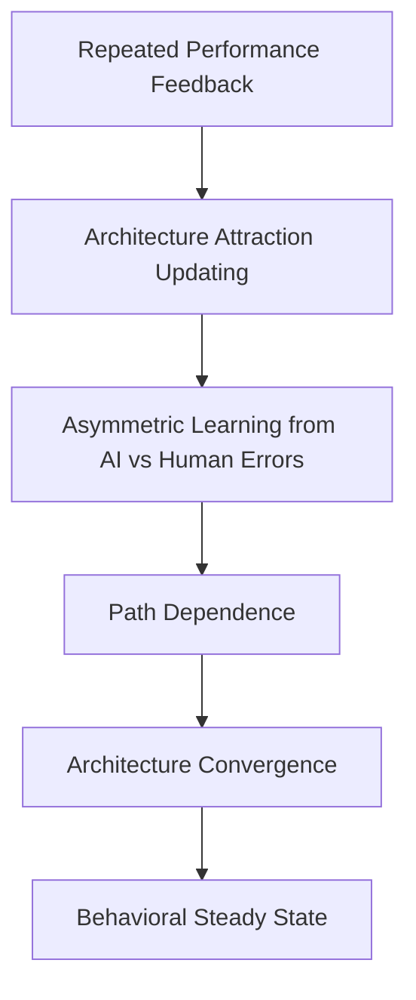
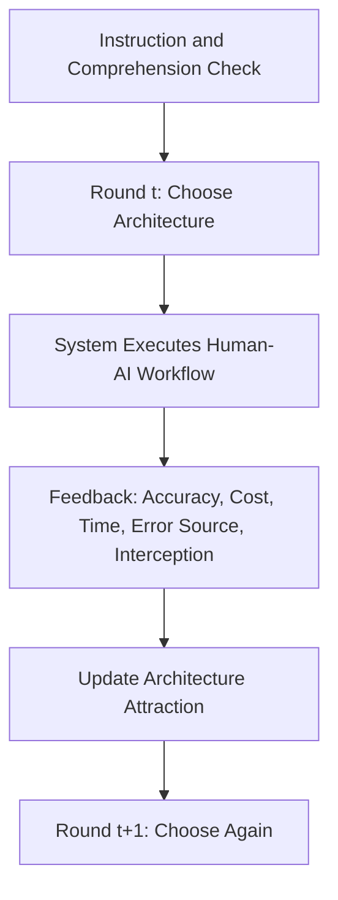
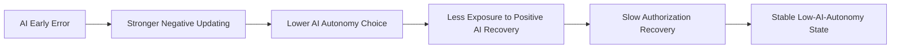

# 学习 AI 的角色：人类如何形成稳定的人机协作架构

**英文标题**  
Learning AI's Role: How Humans Converge Toward Stable Human-AI Collaboration Architectures

## 摘要

生成式人工智能正在快速进入诊断、审核、筛选、推荐与风控等高风险决策场景。与传统技术采纳问题不同，AI 的引入并不只意味着“是否使用”一种工具，而是要求组织和个体不断回答一个更深层的问题：AI 应该在决策系统中扮演什么角色，是只提供建议、参与确认、作为默认方案，还是被赋予较高程度的自主决策权。现有研究对 AI trust、algorithm aversion、appropriate reliance 和 confidence calibration 已有丰富讨论，但这些研究大多聚焦于一次性采纳、单次建议接受或点状信任校准，尚不足以解释人类如何在持续反馈中逐步学习并稳定下来某一种人机协作架构。

本研究据此提出一个新的研究转向：从 trust/adoption 转向 architecture learning，从短期错误反应转向长期收敛路径，从学习 AI 能力转向学习 AI 角色。具体而言，本文关注在 AI 与人类长期客观表现相同的前提下，人类是否会因为早期 AI 错误而形成更强的负向架构更新，并由此路径依赖式地收敛到低 AI 授权的人机协作稳定状态。为解释这一动态机制，本文借鉴 Experience-Weighted Attraction Learning, EWA 的核心逻辑，将 human-only、AI advice、AI recommendation plus human confirmation、AI default plus human override 和 AI autonomous decision 视为五种可被经验反馈不断更新吸引力的协作策略。

在研究设计上，本文拟采用以实验操控为基础的动态因果机制研究。参与者将在 80 轮左右的重复决策任务中扮演“决策系统监督者”，每轮为下一项案例选择一种人机协作架构，并根据系统反馈调整后续选择。实验通过随机分配操控 AI 错误与人类错误的时间分布，包括 AI early error、human early error、evenly distributed errors 和 AI late error 四类条件，同时保持 AI 与人类基础准确率相同，以识别“错误来源”与“错误时点”如何影响架构学习、路径依赖和最终稳定状态。

本文的核心贡献有三点。第一，在理论上，本文将人机协作从“是否依赖 AI”的静态问题推进为“如何学习 AI 角色”的动态问题。第二，在机制上，本文揭示 AI 错误的关键后果并非仅仅降低短期信任，而是改变人机协作架构的长期收敛路径。第三，在方法上，本文将 EWA 从装饰性模型转化为贯穿理论建构、实验设计、变量操作化和参数估计的解释语言，为研究人机协作的学习稳定状态提供一套可操作的动态框架。

**关键词**  
人机协作架构；算法厌恶；路径依赖；EWA；行为稳定状态；AI 治理

---

## 一、研究背景与问题提出

生成式人工智能正在改变组织内部的决策分工方式。与传统软件不同，AI 不只是提供机械化执行能力，它还能够建议、预测、筛选、排序、诊断，甚至直接替代部分人工判断。因此，AI 进入决策系统后，真正需要回答的问题往往不再是“是否采用 AI”，而是“AI 应该在系统中被放在什么位置”。

这一问题在实践中表现得尤其明显。组织可能最初只让 AI 提供建议，但如果其表现稳定，管理者可能逐步降低人工监督，让 AI 成为默认决策者；反之，若 AI 在早期出现明显错误，即便其后续表现恢复，组织也可能长期保留高强度复核、低程度授权的安排。换言之，人机协作架构并非一次性设计出来的制度，而是一个在持续反馈中被学习、被修正、并最终可能被锁定的动态结果。

现有关于 AI 的行为研究虽然已经积累了大量发现，但其核心问题设定仍以 trust、adoption、advice-taking 或 calibration 为主。例如，algorithm aversion 关注的是人们在看到算法犯错后是否更不愿使用算法；appropriate reliance 关注的是人们在某一次决策中是否恰当地采纳 AI 建议；confidence calibration 关注的是个体能否根据 AI 的不确定性线索判断其何时更可能正确。这些研究都很重要，但它们大多停留在点状反应层面，难以解释一个更具制度意义的问题：人类如何从多轮反馈中学习 AI 的系统角色，并收敛到某种稳定的人机协作模式。

本研究的核心命题因此是：**人类不仅学习 AI 是否可靠，更学习 AI 应该被放在什么位置。** 我们关心的不是 AI 一次犯错后信任是否下降，而是 AI 错误是否会改变整个人机协作架构的长期学习路径；我们关注的也不是某一次建议是否被采纳，而是个体和组织在长期反馈中最终会稳定停留在何种授权结构之中。

这一区分具有直接的理论和现实意义。理论上，它将 AI 行为研究从“能力判断”推进到“角色学习”。现实上，它关系到 AI 治理中的一个关键风险：若早期 AI 错误造成了长期的低授权锁定，组织可能即使面对与人类同等甚至更优的 AI，也长期停留在高成本、低自动化、过度人工监督的非最优状态。

---

## 二、文献综述与理论缺口

### 2.1 从 trust 与 appropriate reliance 出发，但不止于 trust

Lee 与 See 将 trust in automation 界定为适当依赖自动化系统的前提，并强调过度信任和信任不足都会损害系统绩效。这一路文献的重要贡献在于指出，人机系统的核心不是简单接受或拒绝自动化，而是“何时依赖、依赖多少”。随后，围绕 AI-assisted decision making 的研究进一步表明，准确率、解释、置信度和个体自身能力感知都会影响人们是否在具体情境下依赖 AI。

但这类研究的分析单位通常是单次决策、单次 reliance 或 case-by-case trust calibration。它告诉我们人们是否会在当下依赖 AI，却不充分解释人们是否会在多轮反馈后稳定地改变制度化授权结构。换言之，trust 和 appropriate reliance 文献主要解释“某一轮怎么选”，而本研究解释“长期会收敛到哪里”。

### 2.2 algorithm aversion 与 appreciation 提供了起点，但未触及架构收敛

Dietvorst, Simmons 与 Massey 的 algorithm aversion 研究发现，人们在看到算法犯错后会对算法更为苛刻，即使算法整体上优于人类判断，也可能被迅速放弃。与此相对，Logg, Minson 与 Moore 也表明，在某些任务中人们会表现出 algorithm appreciation，即对算法判断给予更高权重。两类研究共同说明，算法来源本身会影响个体对错误和正确的学习权重。

然而，无论是 aversion 还是 appreciation，核心对象依然主要是“是否使用算法”或“是否接受算法建议”。这仍然是工具采纳意义上的算法研究，而不是制度分工意义上的人机架构研究。本文继承这一文献对“错误来源非对称性”的关注，但进一步提出：AI 错误的关键不只是降低当期采用概率，而是可能通过更强的负向架构更新改变人机协作架构的长期收敛路径。

### 2.3 confidence calibration 关注的是信号学习，而非角色学习

Zhang、Liao 与 Bellamy 的研究表明，置信度分数有助于个体校准对 AI 的信任，但仅有校准并不自动提升人机联合决策绩效。这提示我们，AI-assisted decision making 的问题不只是给用户更多模型信息，还在于用户如何把这些信息转化为适当行为。

但 confidence calibration 的核心仍是信号层面的：个体是否学会将置信度、解释或不确定性与 AI 正误联系起来。本文关心的则是架构层面的：在反复暴露于 AI 与人类的不同表现之后，人们是否会重新配置 AI 在系统中的权限边界。前者是 signal-level calibration，后者是 architecture-level learning。两者有关联，但不是同一问题。

### 2.4 人机协作与 learning to defer 文献重视角色分配，但多从系统优化出发

近年来，learning to defer 与 human-AI complementarity 文献开始讨论 AI 和人类之间应如何进行任务分配。例如 Mozannar 与 Sontag 关注模型何时应将决策转交给人类专家，相关研究主要从系统设计与机器学习优化角度讨论如何提高人机联合绩效。

这一路研究对本文的重要启发在于，它已经不再把 AI 当作单一工具，而是把“谁来做决策”视为可优化的分工问题。然而，这类研究的核心视角通常是系统如何学习何时 defer，而不是人类如何在经验反馈中学习 AI 应该 occupy 哪种角色。也就是说，learning to defer 关注的是机器侧的分配规则，本文关注的是行为侧的架构学习。

### 2.5 EWA 与路径依赖为动态解释提供了理论语言

EWA 模型提出，个体会根据经验反馈持续更新不同策略的 attraction，并据此生成后续选择概率。它兼具 reinforcement learning 和 belief learning 的特点，尤其适合解释“在重复反馈中不同策略如何逐步变得更具吸引力”。与此同时，路径依赖研究则揭示，早期事件可能通过正反馈和锁定效应持续影响长期结果。

本文将二者结合，提出一个关于人机协作架构学习的动态机制：AI 或 human 的错误与成功并不会只影响即时情绪或瞬时信任，而会通过不对称的 attraction updating 影响后续授权水平；若早期 AI 错误具有更强的负向学习权重，它便可能触发一条通向低 AI-autonomy 稳定状态的路径依赖过程。

### 2.6 本文的理论缺口

综上，现有文献存在三个尚未被系统回答的问题。

第一，现有研究更关注个体是否信任、采用或采纳 AI，而较少把人机协作视为一个会在反馈中逐步收敛的架构学习过程。  
第二，现有研究揭示了 AI 错误与人类错误可能被不同地评价，但尚未充分检验这种非对称学习是否会改变长期授权结构。  
第三，现有研究常在信号校准或单次 reliance 层面展开，却缺少一个能够同时解释错误来源、时间顺序、路径依赖与稳定状态的动态理论框架。

本文的目标正是填补这三个缺口。

---

## 三、研究问题与核心假设

### 3.1 总研究问题

在持续反馈环境中，人类如何学习 AI 应该在决策系统中扮演什么角色，并最终形成稳定的人机协作架构？

### 3.2 子研究问题

1. 在重复绩效反馈下，个体是否会收敛到稳定的人机协作架构？
2. 当 AI 与人类具有相同长期客观表现时，AI 错误是否比人类错误引发更强的负向架构更新？
3. 早期 AI 错误是否会造成路径依赖，使个体长期停留在低 AI 授权的稳定状态？
4. 个体最终形成的稳定状态是否可能偏离客观最优的人机协作架构？

### 3.3 研究假设

**H1 非对称负向学习假设**  
在 AI 与人类长期客观表现相同的情况下，AI 错误比人类错误引发更强的负向架构更新。

**H2 路径依赖假设**  
早期 AI 错误会使参与者长期收敛到更低 AI 授权的人机协作架构。

**H3 恢复不对称假设**  
AI 后续正确反馈对恢复 AI 授权的作用弱于 AI 早期错误对降低 AI 授权的作用。

**H4 人类错误宽容假设**  
人类早期错误不会以对称方式推动参与者转向更高 AI 授权架构。

**H5 非最优稳定状态假设**  
即使 AI 与人类长期客观表现相同，参与者仍可能因对 AI 错误的非对称惩罚而收敛到过度人工监督的非最优稳定状态。

---

## 四、理论框架与概念界定

### 4.1 核心理论主张

本文的核心理论主张可以概括为一句话：**AI 错误的关键后果不是短期信任下降，而是改变人机协作架构的长期学习路径。**

换言之，本文不是研究“AI 是否被信任”，而是研究“AI 被安排在何种系统角色中，并且这种角色安排如何随经验反馈而收敛”。这使得本文从 trust/adoption 逻辑转向 architecture learning 逻辑。

### 4.2 核心概念

**人机协作架构（human-AI collaboration architecture）**  
指 AI 与人类在一个决策系统中的角色分配方式。本文将其操作化为五种水平有序的授权结构：

1. Human-only  
2. AI advice only  
3. AI recommendation + human confirmation  
4. AI default + human override  
5. AI autonomous decision

**架构吸引力（architecture attraction）**  
指个体基于过往反馈，对某一种协作架构形成的主观价值预期。吸引力越高，后续选择该架构的概率越大。

**架构收敛（architecture convergence）**  
指个体在多轮反馈后对某一类架构形成稳定偏好，选择分布不再大幅波动。

**行为稳定状态（behavioral steady state）**  
指在实验后期，个体的人机协作架构选择进入相对稳定区间。本文刻意避免将其直接表述为 Nash equilibrium，因为实验中的 AI 并不是一个独立策略行动者。

**路径依赖（path dependence）**  
指早期反馈事件，尤其是早期 AI 错误，通过持续影响架构吸引力更新，改变长期收敛结果。

### 4.3 理论机制图



### 4.4 理论链条

本文预期的理论链条如下：

1. AI 与人类基础准确率在长期上被设定为相同；
2. 参与者并不对 AI 错误和人类错误赋予相同学习权重；
3. AI 错误引发更强的负向 attraction updating；
4. 若该错误发生在学习早期，其影响会通过减少后续 AI 暴露和授权恢复速度形成路径依赖；
5. 结果是参与者可能长期收敛到低 AI 授权架构，即便该架构在客观绩效和成本上并非最优。

---

## 五、研究设计与方法

### 5.1 研究类型

本研究属于**以实验操控为基础的动态因果机制研究**。其目的不是描述人们喜欢哪种架构，而是识别在可比绩效前提下，不同错误路径如何因果性地改变架构学习、授权收敛和稳定状态。

### 5.2 研究场景与任务设定

主实验拟采用一个抽象但具有管理现实感的“决策系统监督”场景。参与者被置于一个高频决策环境中，例如质量审核、风险筛查或内容审查的运营管理岗位，需要在每一轮为下一项案例选择一种人机协作架构。参与者不是直接执行底层专业判断，而是扮演系统设计与授权的监督者，决定 AI 与 human analyst 在本轮中的角色分配。

这一设定有两个优点。第一，它直接把研究对象放在“架构选择”层面，而不是让个体只在单轮中接受或拒绝一条 AI 建议。第二，它允许研究者在不混入参与者自身专业能力差异的前提下，严格控制 AI 与 human analyst 的长期客观表现，从而识别“学习机制”而非“能力差距”。

### 5.3 参与者与样本规模

拟招募具备基本数字平台实验经验的成人参与者，优先使用线上行为实验平台完成。建议采用“两阶段样本”：

1. 预实验：`n = 40–60`，用于校准任务理解、反馈节奏、成本设置与稳定状态阈值。
2. 正式实验：`n = 320–400`，按四个实验条件随机分配，每组约 `80–100` 人。

正式样本规模的具体数值可在预实验后结合效应量与模拟功效分析进一步微调，但总体上应确保能够支持多层模型估计与 EWA 参数的层级估计。

### 5.4 实验流程

每位参与者完成约 `80` 轮任务。每轮流程如下：

1. 参与者看到当前系统任务背景与上一轮反馈摘要；
2. 从五种协作架构中选择本轮架构；
3. 系统运行该架构下的人机流程；
4. 向参与者反馈本轮结果，包括：
   - 是否正确；
   - 完成时间成本；
   - 审核/复核成本；
   - 最终收益或损失；
   - 错误是否被人工拦截或被 AI 放大；
   - AI 与 human analyst 在该轮各自表现。
5. 参与者进入下一轮，继续调整架构。

### 5.5 五类协作架构的操作化

| 架构 | 角色含义 | AI 授权水平 | 预期成本特征 |
|---|---|---:|---|
| Human-only | 人类分析员独立完成决策 | 1 | 时间成本高，自动化最低 |
| AI advice only | AI 提供建议，人类主导决定 | 2 | 信息支持增强，但人工负担仍高 |
| AI + human confirmation | AI 给出推荐，人类必须确认 | 3 | 安全性较高，但复核成本高 |
| AI default + human override | AI 先执行，人类保留覆核权 | 4 | 平衡效率与监督，可能为客观最优 |
| AI autonomous decision | AI 独立完成决策 | 5 | 时间成本最低，但完全依赖 AI |

本文将以 `1–5` 对应一个有序的 `AI autonomy level` 指标，用于追踪授权收敛路径。

### 5.6 关键实验前提

为保证识别逻辑成立，实验须严格满足以下前提：

1. **AI 与 human analyst 的长期基础准确率相同**，例如都设定为 `80%`；
2. **实验条件之间唯一关键差异是错误分布路径，而不是长期平均绩效差异**；
3. **不同架构之间的客观效用差异来自授权结构、时间成本、复核成本与错误拦截概率，而非“AI 天然更差”**；
4. **参与者在实验开始前已充分理解五类架构的含义与成本后果**。

### 5.7 实验条件

**条件 1：AI Early Error**  
AI 的错误集中出现在前期关键轮次，但全程平均准确率仍与 human analyst 相同。该条件用于检验早期 AI 错误是否触发低 AI 授权路径依赖。

**条件 2：Human Early Error**  
human analyst 的错误集中出现在前期关键轮次，而 AI 的长期表现与其相同。该条件用于检验个体是否会对人类错误给予同等程度的惩罚，或是否对 AI 错误更为敏感。

**条件 3：Evenly Distributed Errors**  
AI 与 human analyst 的错误均匀分布，作为基准路径。该条件用于观察在没有明显早期冲击时，参与者是否更可能向客观较优架构收敛。

**条件 4：AI Late Error**  
AI 错误集中在后期而非前期。该条件用于检验错误时点本身是否决定了路径依赖强度，并与 AI Early Error 形成对照。

### 5.8 因变量与关键指标

本文的主因变量不是 trust，而是架构学习与收敛相关变量：

1. 最终收敛到哪一种人机协作架构；
2. 后期轮次的平均 `AI autonomy level`；
3. 是否形成低 AI 授权稳定状态；
4. 收敛速度；
5. 授权恢复速度；
6. 后期选择方差与震荡程度；
7. EWA 参数中的正负向学习率；
8. 最终稳定架构相对客观最优架构的偏离程度。

### 5.9 稳定状态的判定标准

若满足以下多数条件，可判定参与者进入行为稳定状态：

1. 最后 `15` 轮中某一架构被选择的比例超过 `70%`；
2. 最后 `15` 轮的 `AI autonomy level` 方差低于预设阈值；
3. 架构选择概率不再随轮次显著变化；
4. EWA 模型估计的 attraction 值进入相对稳定区间。

若后期平均授权水平持续低于中位数，可进一步界定为“低 AI 授权稳定状态”。

### 5.10 客观最优架构的界定

为检验 H5，研究需在实验前根据准确率、时间成本、人工复核成本与错误损失构造一个**客观效用函数**。一个简单形式为：

```text
Expected Utility
= Accuracy Bonus
- Error Penalty
- Time Cost
- Human Review Cost
```

在基准参数设定下，研究可以使 `AI default + human override` 成为长期客观效用最高的架构，从而检验参与者是否因早期 AI 错误而偏离这一较优安排，稳定停留于更低授权、但更低效的结构中。

---

## 六、EWA-inspired 模型与数据分析计划

### 6.1 模型直觉

EWA 在本文中不是附加在结果之后的统计装饰，而是贯穿全文的理论语言。其基本思想是：参与者会根据每轮反馈更新不同架构的吸引力，下一轮则更可能选择吸引力更高的架构。若 AI 错误带来的负向更新强于 human error，且这种影响在早期尤其显著，那么长期路径就可能被改写。

### 6.2 模型表达

令 `k ∈ {1,2,3,4,5}` 表示五种人机协作架构，`A_{k,t}` 表示参与者在第 `t` 轮结束时对架构 `k` 的吸引力，`s_t` 表示实际选择的架构。一个可估计的 EWA-inspired 更新形式如下：

```text
N_t = ρN_{t-1} + 1

A_{k,t}
= [φN_{t-1}A_{k,t-1}
 + [δ + (1-δ)I(s_t = k)]U_{k,t}] / N_t

P(s_{t+1}=k)
= exp(βA_{k,t}) / Σ_j exp(βA_{j,t})
```

其中：

- `ρ` 表示经验存量衰减；
- `φ` 表示过去 attraction 的保留程度；
- `δ` 表示反事实学习权重；
- `β` 表示选择敏感度。

为了识别错误来源的非对称性，本文进一步将即时效用 `U_{k,t}` 分解为来源与正负反馈的组合：

```text
U_{k,t}
= α_AI^+ * I(AI correct)
+ α_AI^- * I(AI error)
+ α_Human^+ * I(Human correct)
+ α_Human^- * I(Human error)
- c_t
```

其中 `c_t` 代表时间成本、复核成本和风险暴露成本。本文的关键检验量包括：

```text
α_AI^- > α_Human^-
|α_AI^-| > |α_AI^+|
```

若上述不等式成立，则说明 AI 错误被更强地惩罚，且其损伤效应大于后续正确表现的修复效应。

### 6.3 统计分析路径

本文拟采用三层分析框架：

**第一层：描述性动态分析**  
绘制各条件下 `AI autonomy level` 的平均轨迹、不同架构选择比例、收敛速度和后期方差，以直观观察收敛与路径差异。

**第二层：因果识别分析**  
使用多层混合效应模型或广义估计方程，检验条件、轮次及其交互对架构选择和授权水平的影响。核心关注 `AI Early Error × Round` 是否显著降低后期授权水平。

**第三层：结构估计分析**  
使用层级贝叶斯或最大似然方法估计 EWA 参数，比较不同条件下的 `α_AI^-`、`α_Human^-`、`β` 与 `δ`。结构参数将直接对应本文提出的非对称学习与路径依赖机制。

### 6.4 稳健性检验

1. 改变稳定状态阈值，例如将“最后 15 轮占比 70%”替换为“最后 20 轮占比 65%”；
2. 改变客观最优架构的成本权重设定，检验 H5 是否稳健；
3. 将后期授权均值、收敛速度和结构参数三类指标交叉验证；
4. 在补充实验中将任务场景从抽象风控切换为质量检测或内容审核，以检验外部效度。

---

## 七、预期研究发现与理论贡献

### 7.1 预期研究发现

本文预期会观察到以下模式：

1. 参与者会在重复反馈中形成相对稳定的人机协作架构，而不是长期随机摇摆；
2. 在长期客观表现相同的前提下，AI 错误比 human analyst 错误更容易触发负向授权更新；
3. AI early error 会显著降低后期平均授权水平，并延缓回到高 AI 授权架构的速度；
4. 一部分参与者会稳定停留在人类监督过重的结构中，表现出非最优锁定。

### 7.2 理论贡献

**第一，提出 architecture learning 视角。**  
本文将 AI 行为研究从 trust/adoption 推进到 role/architecture learning，强调人类学习的不是单纯的 AI 能力，而是 AI 在系统中的权限位置。

**第二，揭示 AI 错误的长期机制后果。**  
本文认为 AI 错误的真正危险不只是降低短期信任，而是通过不对称学习改变长期收敛路径。相比传统 algorithm aversion，这是一种更强、更动态的理论命题。

**第三，构建“反馈—吸引力更新—路径依赖—收敛—稳定状态”的完整链条。**  
本文通过 EWA-inspired 机制把离散的 trust、reliance、defer 和 calibration 研究整合为一个关于制度化分工形成的动态理论框架。

**第四，避免误用 Nash equilibrium。**  
本文将稳定结果表述为 behavioral steady state 或 learning equilibrium，更符合实验语境下的人机协作本质。

---

## 八、实践意义与 AI 治理启示

本研究对组织管理与 AI 治理至少有三点启示。

第一，组织在部署 AI 时不能只看长期平均准确率，还必须重视**早期反馈序列**。如果系统在刚上线时发生高可见度错误，后续即便修复，也可能难以恢复授权。

第二，AI 治理不应只围绕“是否允许使用 AI”制定规则，而应把**人机协作架构**视为一个需要动态设计与维护的对象。不同监督强度、默认权设置和 override 机制会系统性影响长期采纳路径。

第三，若研究证实存在低自动化锁定，组织在技术引入初期就应设计**缓冲机制**，例如分阶段授权、错误解释框架、渐进式默认权迁移和可逆试运行窗口，以防止一次早期冲击造成长期非最优配置。

---

## 九、可行性、潜在风险与应对方案

### 9.1 可行性

本研究的可行性较高，原因在于：

1. 任务可在标准在线行为实验平台中实施；
2. 所需操控变量主要是错误时间分布与成本参数，均可程序化控制；
3. 结果变量明确，可结合行为轨迹与结构参数进行双重识别；
4. 研究不依赖参与者拥有高门槛专业知识，便于扩大样本。

### 9.2 潜在风险

**风险 1：被误解为 algorithm aversion 的简单复制。**  
应对：在引言、假设和分析中持续强调本研究的单位是“架构收敛”，而非单次算法拒绝。

**风险 2：被混同为 confidence calibration 研究。**  
应对：不将 AI 置信度信号作为核心操控，不以“人们是否学会信号可靠性”为主问题，而以“人们是否学习 AI 的系统角色”为主问题。

**风险 3：EWA 仅成为后置模型。**  
应对：在研究问题、概念界定、实验设计、变量构造和参数解释中全程使用 attraction updating 逻辑。

**风险 4：轮次不足以观察收敛。**  
应对：主实验轮次控制在 `80` 左右，必要时在预实验后上调到 `100`。

**风险 5：客观最优架构界定不清。**  
应对：在实验前显式设定效用函数并进行参数敏感性检验，保证“非最优锁定”有清晰的比较基准。

**风险 6：AI 与 human analyst 的可比性不足。**  
应对：通过程序控制保持长期基础准确率一致，只改变错误出现的时点和可见序列。

---

## 十、研究进度安排

| 阶段 | 时间安排 | 核心任务 |
|---|---|---|
| 第 1 阶段 | 第 1–2 月 | 完成文献梳理、研究问题定稿、实验任务脚本与界面原型 |
| 第 2 阶段 | 第 3 月 | 开展预实验，校准成本参数、轮次和稳态判定阈值 |
| 第 3 阶段 | 第 4–5 月 | 实施正式实验并清洗数据 |
| 第 4 阶段 | 第 6 月 | 完成描述性分析、多层模型分析和 EWA 结构估计 |
| 第 5 阶段 | 第 7 月 | 撰写论文初稿与导师汇报材料 |
| 第 6 阶段 | 第 8 月 | 根据反馈修订，补做稳健性分析和补充实验 |

---

## 十一、结论

本文提出，AI 时代最值得研究的问题，不再只是人们是否信任 AI、是否采用 AI，或是否在某一轮中接受了 AI 建议，而是人们如何在持续反馈中学习 AI 应该占据什么系统角色，并最终形成稳定的人机协作架构。通过将 AI 错误、人类错误、授权结构和长期收敛路径放入同一套 EWA-inspired 动态框架，本文力图说明：**AI 错误的关键后果，不是一次性的信任受损，而是长期制度分工路径的改变。**

---

## 附录 A：文献矩阵

| 文献流派 | 代表文献 | 核心发现 | 对本文的启发 | 本文的推进 |
|---|---|---|---|---|
| Trust in automation | Lee & See (2004) | 适当依赖是自动化绩效的核心 | 人机系统的关键不是用不用，而是如何依赖 | 将“适当依赖”从单次判断扩展到长期架构收敛 |
| Algorithm aversion | Dietvorst et al. (2015) | 看到算法犯错后，人们会过度回避算法 | AI 错误可能被更严厉惩罚 | 从单次算法回避推进到长期低授权锁定 |
| Algorithm appreciation | Logg et al. (2019) | 某些条件下人们反而偏好算法判断 | 算法偏好与厌恶并存，取决于任务与比较方式 | 用动态实验解释二者何以转化为不同收敛路径 |
| Confidence calibration | Zhang et al. (2020) | 置信度有助于信任校准，但不必然提升联合绩效 | 信号学习与绩效改善并不等价 | 明确区分 signal-level calibration 与 architecture-level learning |
| Appropriate trust in AI-assisted decisions | Ma et al. (2023) | 人们需要知道何时信 AI、何时信自己 | reliance 是人机互补的重要问题 | 将“何时信任”上升为“如何配置角色” |
| Learning to defer | Mozannar & Sontag (2020) | 模型可学习何时将决策交由人类 | 角色分配本身是可建模问题 | 从机器侧分流推进到人类侧授权学习 |
| EWA | Camerer & Ho (1999) | 个体根据反馈更新策略吸引力 | 适合解释重复反馈中的选择演化 | 将策略重定义为人机协作架构 |
| Path dependence | David (1985); Arthur (1989) | 早期事件可能锁定长期结果 | 早期 AI 错误可能具有长期后果 | 将路径依赖引入 AI 授权与协作稳定状态 |

---

## 附录 B：实验流程图



---

## 附录 C：预期收敛路径图



---

## 附录 D：导师汇报 PPT 大纲（10–12 页）

### 第 1 页：标题页

- 研究题目
- 作者信息
- 汇报场景与日期

### 第 2 页：研究背景

- AI 进入决策系统后，问题从“是否采用”转向“如何协作”
- 现实中的授权、监督、override 与 delegation 问题

### 第 3 页：核心研究转向

- 从 trust/adoption 转向 architecture learning
- 从短期错误反应转向长期收敛路径
- 从学习 AI 能力转向学习 AI 角色

### 第 4 页：文献回顾与缺口

- algorithm aversion / appreciation
- appropriate reliance / trust calibration
- confidence calibration
- learning to defer
- 尚缺“长期架构学习”视角

### 第 5 页：研究问题与假设

- 总研究问题
- H1–H5 简要列示

### 第 6 页：理论机制图

- Repeated feedback
- Attraction updating
- Path dependence
- Convergence
- Behavioral steady state

### 第 7 页：实验设计

- 参与者角色
- 五类协作架构
- 80 轮重复任务

### 第 8 页：条件操控

- AI early error
- Human early error
- Evenly distributed errors
- AI late error

### 第 9 页：变量与测量

- 最终架构
- AI autonomy level
- 收敛速度
- 恢复速度
- 稳定状态指标

### 第 10 页：EWA-inspired 模型

- attraction updating 逻辑
- 关键参数
- 非对称学习检验

### 第 11 页：预期贡献

- 理论贡献
- 方法贡献
- AI 治理启示

### 第 12 页：风险与下一步

- 概念混淆风险
- 识别与轮次风险
- 预实验计划与数据实施安排

---

## 附录 E：逻辑风险审核报告

### 审核结论

本研究整体逻辑成立，且具备较强的新颖性，但必须始终守住以下边界：

1. **不能写成 AI trust 研究。**  
   主问题必须是长期架构学习，而非“AI 出错后是否降低信任”。

2. **不能写成单次 advice-taking 研究。**  
   重点必须放在最终收敛到何种人机协作架构，而非某一轮是否采纳建议。

3. **不能混入 confidence calibration。**  
   本文不是研究人们是否学会解读 AI confidence，而是研究人们是否学会配置 AI 角色。

4. **不能误用 Nash equilibrium。**  
   应使用 behavioral steady state、learning equilibrium 或 architecture convergence。

5. **EWA 不能只是模型尾注。**  
   必须贯穿研究问题、机制说明、实验设计与参数解释。

6. **实验必须足够长。**  
   若轮次过少，就无法支持“收敛”和“路径依赖”这两个核心命题。

### 最终定位句

> 本研究的核心不是 AI 是否被信任，而是 AI 错误是否通过非对称学习改变人机协作架构的长期收敛路径，并使人类稳定在某种高或低 AI 授权状态。

---

## 参考文献

1. Lee, J. D., & See, K. A. (2004). *Trust in Automation: Designing for Appropriate Reliance*. *Human Factors, 46*(1), 50-80. [https://journals.sagepub.com/doi/10.1518/hfes.46.1.50_30392](https://journals.sagepub.com/doi/10.1518/hfes.46.1.50_30392)
2. Dietvorst, B. J., Simmons, J. P., & Massey, C. (2015). *Algorithm Aversion: People Erroneously Avoid Algorithms After Seeing Them Err*. *Journal of Experimental Psychology: General, 144*(1), 114-126. [https://pubmed.ncbi.nlm.nih.gov/25401381/](https://pubmed.ncbi.nlm.nih.gov/25401381/)
3. Logg, J. M., Minson, J. A., & Moore, D. A. (2019). *Algorithm Appreciation: People Prefer Algorithmic to Human Judgment*. *Organizational Behavior and Human Decision Processes, 151*, 90-103. [https://doi.org/10.1016/j.obhdp.2018.12.005](https://doi.org/10.1016/j.obhdp.2018.12.005)
4. Zhang, Y., Liao, Q. V., & Bellamy, R. K. E. (2020). *Effect of Confidence and Explanation on Accuracy and Trust Calibration in AI-Assisted Decision Making*. *FAT\* 2020*. [https://doi.org/10.1145/3351095.3372852](https://doi.org/10.1145/3351095.3372852)
5. Ma, S., Lei, Y., Wang, X., Zheng, C., Shi, C., Yin, M., & Ma, X. (2023). *Who Should I Trust: AI or Myself? Leveraging Human and AI Correctness Likelihood to Promote Appropriate Trust in AI-Assisted Decision-Making*. *CHI 2023*. [https://doi.org/10.1145/3544548.3581058](https://doi.org/10.1145/3544548.3581058)
6. Mozannar, H., & Sontag, D. (2020). *Consistent Estimators for Learning to Defer to an Expert*. *Proceedings of Machine Learning Research, 119*, 7076-7087. [https://proceedings.mlr.press/v119/mozannar20b.html](https://proceedings.mlr.press/v119/mozannar20b.html)
7. Camerer, C., & Ho, T.-H. (1999). *Experience-Weighted Attraction Learning in Normal Form Games*. *Econometrica, 67*(4), 827-874. [https://onlinelibrary.wiley.com/doi/10.1111/1468-0262.00054](https://onlinelibrary.wiley.com/doi/10.1111/1468-0262.00054)
8. David, P. A. (1985). *Clio and the Economics of QWERTY*. *American Economic Review, 75*(2), 332-337. [https://ideas.repec.org/a/aea/aecrev/v75y1985i2p332-37.html](https://ideas.repec.org/a/aea/aecrev/v75y1985i2p332-37.html)
9. Arthur, W. B. (1989). *Competing Technologies, Increasing Returns, and Lock-In by Historical Events*. *The Economic Journal, 99*(394), 116-131. [https://academic.oup.com/ej/article-abstract/99/394/116/5188212](https://academic.oup.com/ej/article-abstract/99/394/116/5188212)
