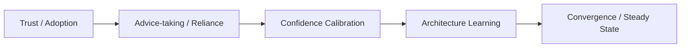
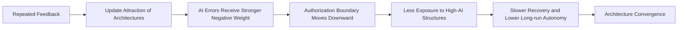
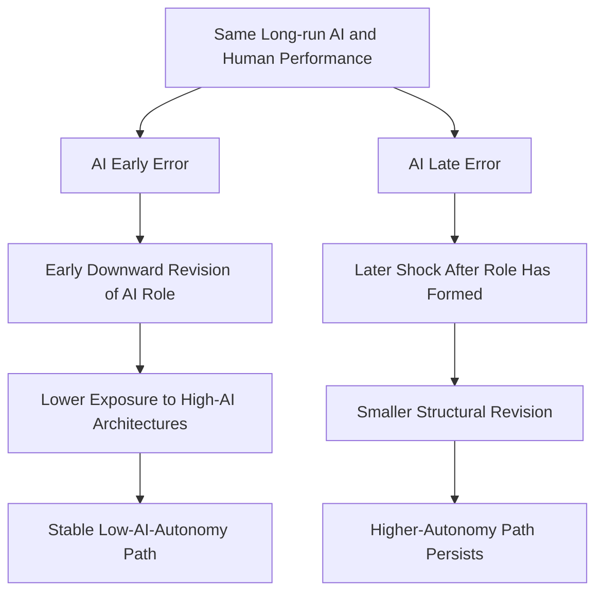
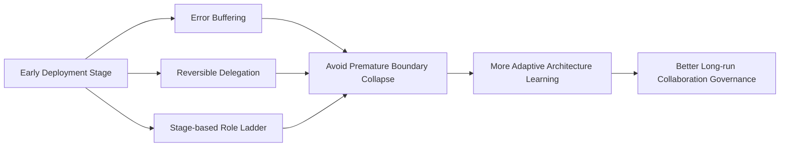
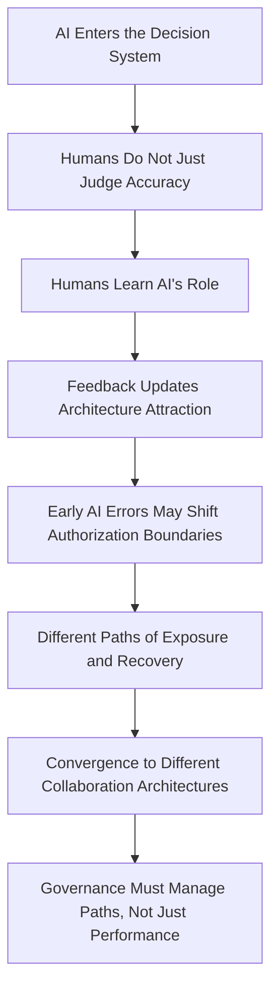

# 图示与口头讲述说明

## 使用原则

1. 图不要画成“一个人看见 AI 出错，然后信任下降”的心理反应图。
2. 图要持续突出三个词：`role`, `path`, `convergence`。
3. 每张图都要让听众看到“结构如何形成”，而不是只看到“态度如何波动”。
4. 口头讲述时反复强调：更新的是协作架构，不是一个单独的 trust 分数。

## 图 1：文献转向图

### 这张图要表达什么

这不是说前面的文献不重要，而是说它们主要回答的是“是否依赖”“是否采纳”“是否理解信号”之类的局部问题。我们的推进点在于：把这些局部反应放进一个更长的时间轴里，去解释协作架构如何形成。

### 建议口播

“我想先说明，这项研究不是否定 trust、reliance 或 calibration 文献，而是沿着它们往前再推一步。前面的研究大多停留在单次反应层面，而我们想解释的是，在反复反馈之后，人和 AI 最终会被安放成什么样的稳定协作结构。”

### 讲图时要点

1. 前三项代表既有主流问题。
2. `Architecture learning` 是新的研究对象。
3. `Convergence / Steady State` 说明结果不是一个瞬时反应，而是长期终局。

### 不要这样讲

不要说“我们研究 trust 的后果”。这样听众会自动把新问题吸回旧文献。

## 图 2：经验学习机制图

### 这张图要表达什么

这张图是整篇研究最关键的机制图。它要说明，AI 错误不是直接通向“信任下降”，而是通过不对称学习，改变不同协作架构的吸引力，继而重画权限边界，并改写后续暴露机会。

### 建议口播

“我们的核心机制是，反馈更新的不是一个抽象的信任水平，而是不同协作架构的吸引力。AI 错误如果被更强地惩罚，就会更快压低高授权架构的吸引力。高授权架构一旦更少被选择，参与者之后接触和修正它的机会也变少，于是恢复变慢，系统更容易收敛到低 AI autonomy 的稳定状态。”

### 讲图时要点

1. `Attraction` 的对象是架构，不是 AI 本身。
2. `Boundary` 是口头上必须强调的词，因为它直接连接治理含义。
3. `Less Exposure` 是路径依赖的关键中介，说明为什么早期错误会留下长期后果。

### 不要这样讲

不要把这张图讲成“AI 犯错被惩罚，所以大家不喜欢 AI”。这会让机制失去制度层次。

## 图 3：路径分叉图

### 这张图要表达什么

这张图强调一个很适合会议场合讲清楚的观点：**同样的长期平均表现，不同的错误时点，也可能导向不同的协作结构终点。** 也就是说，结果不是只由能力水平决定，也由经验路径决定。

### 建议口播

“这项研究最想证明的一点是，长期平均能力相同，并不保证长期协作结构相同。因为人不是只在累计正确率，他们还在学习 AI 应该扮演什么角色。早期错误发生得越早，就越可能在角色尚未稳定时触发边界下移，最后把系统带到一个更低授权的终点。”

### 讲图时要点

1. 左右两条路径的终点不同，但起点相同。
2. 这强化了路径依赖而不是能力差异。
3. 这是识别策略最值得讲的地方。

### 不要这样讲

不要把差异解释成“AI 早期表现更差所以大家更不信它”。这里必须强调长期平均表现被控制住了。

## 图 4：治理干预图

### 这张图要表达什么

如果前面的理论成立，治理就不该只是一套性能监控机制，而应该是一套帮助组织避免过早锁定错误协作结构的设计机制。干预重点是早期错误缓冲、可逆授权和分阶段角色爬坡。

### 建议口播

“治理上的关键启示是，部署初期不是普通磨合期，而是制度定型期。组织需要的不只是知道 AI 平均表现怎么样，而是要避免一次早期错误太快地把权限边界压缩下去。所以治理工具应该围绕错误缓冲、可逆授权和分阶段角色提升来设计。”

### 讲图时要点

1. 把治理对象从性能转到路径。
2. 把治理动作从处罚转到结构设计。
3. 把部署初期重新定义为高敏感阶段。

### 不要这样讲

不要把治理简化成“多做用户教育”或“多提升模型准确率”。这些都不够触及结构锁定问题。

## 一页总图建议

如果只允许放一张总图，建议使用下面这张：

### 这张总图的 45 秒讲法

“整篇研究可以压缩成这一条链。AI 进入系统之后，人们并不只是判断它准不准，而是在学习它该扮演什么角色。反馈更新的是不同协作架构的吸引力，早期 AI 错误则可能把权限边界向下推。边界一变，后面的暴露和恢复路径也会变，最后系统就可能收敛到不同的人机协作结构。因此治理真正要管理的，不只是性能，而是路径。”

## 出图时的措辞红线

1. 少用“信任下降”，多用“边界下移”“授权收缩”“角色重排”。
2. 少用“是否采用”，多用“采用后如何配置”。
3. 少用“算法被回避”，多用“高 AI 架构失去吸引力”。
4. 少用“校准信号”，多用“学习系统角色”。
