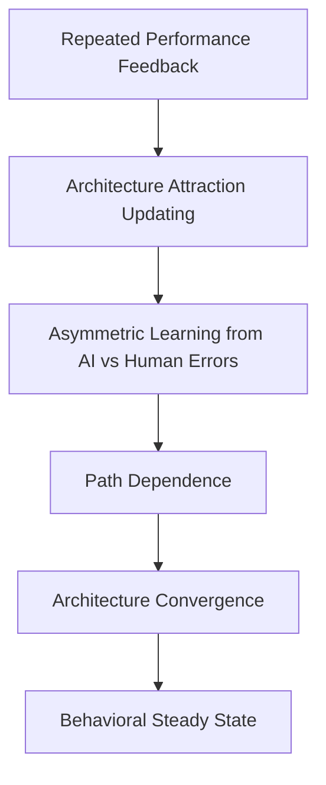

# Agent A 交付件：文献与理论架构

## 一、任务定位

本交付件对应原计划中的 `Agent A：文献与理论架构 Agent`。目标是完成四件事：

1. 建立研究主题的文献地图。
2. 识别本文与既有文献的边界与缺口。
3. 形成正式研究问题。
4. 建立可供全文使用的理论框架。

本交付件始终围绕以下定位展开：

> 本研究不是 trust、单次 reliance 或 confidence calibration 研究，而是一个关于 **human-AI collaboration architecture learning** 的动态研究。

---

## 二、文献矩阵

| 文献流派 | 代表文献 | 研究关注 | 关键发现 | 对本研究的启发 | 本研究的推进 |
|---|---|---|---|---|---|
| Trust in automation | Lee & See (2004) | 人们如何适当依赖自动化 | 过度信任与信任不足都会损害绩效 | “是否依赖、依赖多少”比简单接受更重要 | 从单次依赖推进到长期架构配置 |
| Algorithm aversion | Dietvorst et al. (2015) | 看到算法犯错后是否回避算法 | 算法犯错后常被更严厉惩罚 | AI error 可能被非对称惩罚 | 从短期回避推进到长期低授权锁定 |
| Algorithm appreciation | Logg et al. (2019) | 人们是否反而偏好算法判断 | 在某些任务中人们更偏好算法 | 对算法的态度并非单向厌恶 | 解释为何不同反馈路径会产生不同收敛方向 |
| Appropriate reliance | Ma et al. (2023) | 何时信 AI、何时信自己 | reliance 与主客体正确率判断有关 | reliance 是重要中介，但仍偏单次选择 | 将 reliance 嵌入长期反馈与角色学习 |
| Confidence calibration | Zhang et al. (2020) | 用户能否理解 AI confidence | 置信度有助于校准，但不必然提升绩效 | 信号学习不等于角色学习 | 明确与 signal-level calibration 区分 |
| Human-AI collaboration | 人机协作文献综述与协同决策研究 | 人机如何分工以提高整体绩效 | 分工结构决定系统效率与责任分布 | 协作架构本身是研究对象 | 把“协作架构”设为核心自变量与因变量 |
| Learning to defer | Mozannar & Sontag (2020) | 模型何时应把决策交给人类 | 分流规则可以被优化学习 | 角色分配不只是管理问题，也是学习问题 | 从机器侧 defer 转向人类侧授权学习 |
| Reinforcement / belief learning | Erev & Roth; Camerer & Ho | 重复任务中策略如何被更新 | 个体会根据经验反馈更新策略权重 | 适合解释多轮反馈中的行为演化 | 把策略重定义为“人机协作架构” |
| EWA | Camerer & Ho (1999) | 策略吸引力如何随反馈更新 | attraction 是动态选择的桥梁 | 为本文提供理论语言 | EWA 不只是工具，而是全文机制主线 |
| Path dependence | David (1985); Arthur (1989) | 早期事件是否锁定长期结果 | 早期冲击可能改变长期均势 | AI early error 可能造成低授权锁定 | 将路径依赖引入人机协作与 AI 治理 |

---

## 三、与现有文献的边界区分

### 1. 本研究不是 trust 研究

既有 trust 研究通常问：

```text
AI 出错后，人们是否降低信任？
AI 看起来更可靠时，人们是否更愿意使用？
```

本研究问的是：

```text
在持续反馈中，人们最终会把 AI 放在什么协作位置？
```

也就是说，本研究关心的是**长期角色配置**，而不是短期信任波动。

### 2. 本研究不是单次 advice-taking 研究

既有 reliance 文献更常问：

```text
这一轮 AI advice 正确时，人们会不会采纳？
这一轮 AI advice 错误时，人们会不会拒绝？
```

本研究问的是：

```text
未来系统应该采用哪种人机协作架构？
```

因此，研究对象不是单次建议接受，而是**长期架构选择与稳定化**。

### 3. 本研究不是 confidence calibration 研究

confidence calibration 关注的是：

```text
用户是否学会 AI 的 confidence signal 与 AI correctness 之间的关系？
```

本研究关注的是：

```text
在多轮反馈后，AI 应该自主决策、只做建议，还是必须由人类确认？
```

两者区别可以概括为：

```text
Signal-level calibration
vs
Architecture-level learning
```

### 4. 本研究不是 algorithm aversion 的重复

algorithm aversion 的典型命题是：

```text
AI 犯错后，人们是否回避 AI？
```

本研究推进为：

```text
AI 犯错后，人们是否长期稳定在低 AI 授权架构中？
```

因此，本文不是重复“回避”问题，而是在研究**长期路径依赖和稳定状态**。

---

## 四、理论缺口说明

综合文献后，可以明确识别出三个关键缺口。

### 缺口一：从是否依赖，到如何配置角色

既有研究大多解释个体是否信 AI、是否使用 AI，或者是否在当下依赖 AI；但它们较少解释人在反复反馈中如何逐步学习 AI 的系统角色。

### 缺口二：从短期反应，到长期收敛路径

算法厌恶研究已经证明人们会对 AI error 更敏感，但尚未充分检验这种非对称学习是否会改变长期授权边界，并形成路径依赖。

### 缺口三：从局部信号，到架构层动态机制

既有 calibration 研究多停留在 signal 层，而本文希望解释的是：

```text
Repeated Feedback
    ->
Architecture Attraction Updating
    ->
Path Dependence
    ->
Architecture Convergence
    ->
Behavioral Steady State
```

---

## 五、正式研究问题

### 总研究问题

在持续反馈环境中，人类如何学习 AI 应该在决策系统中扮演什么角色，并最终形成稳定的人机协作架构？

### 子研究问题

1. 在重复绩效反馈下，个体是否会收敛到稳定的人机协作架构？
2. 当 AI 与人类具有相同长期客观表现时，AI error 是否比 human error 引发更强的负向架构更新？
3. 早期 AI error 是否会导致个体路径依赖式地收敛到低 AI autonomy 架构？
4. 个体最终形成的稳定状态是否可能偏离客观最优协作结构？

### 对应英文版本

1. Do humans converge toward stable human-AI collaboration architectures under repeated feedback?
2. When AI and human decision-makers exhibit equivalent objective performance, do AI errors trigger stronger negative updating of collaboration architectures than comparable human errors?
3. Do early AI errors create path-dependent convergence toward low-AI-autonomy collaboration architectures?
4. Do humans settle into suboptimal collaboration architectures despite equivalent AI and human performance?

---

## 六、理论框架

### 1. 核心理论链条

```text
AI 与 human 长期客观表现相同
    ->
但 AI error 与 human error 被不同地学习
    ->
AI error 产生更强的负向 architecture attraction updating
    ->
早期 AI error 造成路径依赖
    ->
人类收敛到低 AI 授权的人机协作稳定状态
    ->
该稳定状态可能偏离客观最优
```

### 2. 理论框架图



---

## 七、核心概念定义

### Human-AI Collaboration Architecture

指 AI 与人类在决策系统中的角色分配方式。本文将其操作化为五类结构：

1. Human-only
2. AI advice only
3. AI recommendation + human confirmation
4. AI default + human override
5. AI autonomous decision

### Architecture Attraction

指参与者对某一种协作架构的主观吸引力或偏好强度，它会随着成功、失败、成本与风险反馈不断被更新。

### Architecture Convergence

指参与者在多轮反馈后，对某类协作架构形成稳定偏好，选择分布不再大幅波动。

### Behavioral Steady State

指实验后期架构选择进入相对稳定状态。本文刻意不用 Nash equilibrium，因为实验中的 AI 不是独立策略行动者。

### Path Dependence

指早期反馈，尤其是 early AI error，对长期稳定状态产生持续影响。

---

## 八、可直接进入正文的理论贡献段落

本文的理论贡献主要体现在三个层面。第一，本文将 AI 行为研究从 trust/adoption 推进到 architecture learning，强调人类学习的不是 AI 是否可靠这一单一判断，而是 AI 在决策系统中的权限位置。第二，本文将 AI error 的后果从短期 algorithm aversion 推进到长期路径依赖机制，指出 AI error 的关键问题并非只在于即时信任下降，而在于它可能通过非对称 learning weight 改变后续授权路径。第三，本文借助 EWA 的 attraction updating 逻辑，将 repeated feedback、path dependence、architecture convergence 与 behavioral steady state 组织为一条完整理论链条，为研究人机协作架构的形成提供了更动态的解释框架。

---

## 九、Agent A 完成结果摘要

本交付件已经完成原计划对 Agent A 的主要要求：

1. 已整理文献矩阵。
2. 已区分本文与 trust、reliance、confidence calibration、algorithm aversion 的边界。
3. 已形成总问题与子问题。
4. 已建立理论框架与核心概念。
5. 已输出可直接进入 proposal 的理论段落。

---

## 参考文献

1. Lee, J. D., & See, K. A. (2004). *Trust in Automation: Designing for Appropriate Reliance*. *Human Factors, 46*(1), 50-80. [https://journals.sagepub.com/doi/10.1518/hfes.46.1.50_30392](https://journals.sagepub.com/doi/10.1518/hfes.46.1.50_30392)
2. Dietvorst, B. J., Simmons, J. P., & Massey, C. (2015). *Algorithm Aversion: People Erroneously Avoid Algorithms After Seeing Them Err*. *Journal of Experimental Psychology: General, 144*(1), 114-126. [https://pubmed.ncbi.nlm.nih.gov/25401381/](https://pubmed.ncbi.nlm.nih.gov/25401381/)
3. Logg, J. M., Minson, J. A., & Moore, D. A. (2019). *Algorithm Appreciation: People Prefer Algorithmic to Human Judgment*. *Organizational Behavior and Human Decision Processes, 151*, 90-103. [https://doi.org/10.1016/j.obhdp.2018.12.005](https://doi.org/10.1016/j.obhdp.2018.12.005)
4. Zhang, Y., Liao, Q. V., & Bellamy, R. K. E. (2020). *Effect of Confidence and Explanation on Accuracy and Trust Calibration in AI-Assisted Decision Making*. *FAT* 2020. [https://doi.org/10.1145/3351095.3372852](https://doi.org/10.1145/3351095.3372852)
5. Ma, S., Lei, Y., Wang, X., Zheng, C., Shi, C., Yin, M., & Ma, X. (2023). *Who Should I Trust: AI or Myself? Leveraging Human and AI Correctness Likelihood to Promote Appropriate Trust in AI-Assisted Decision-Making*. *CHI 2023*. [https://doi.org/10.1145/3544548.3581058](https://doi.org/10.1145/3544548.3581058)
6. Mozannar, H., & Sontag, D. (2020). *Consistent Estimators for Learning to Defer to an Expert*. *PMLR 119*, 7076-7087. [https://proceedings.mlr.press/v119/mozannar20b.html](https://proceedings.mlr.press/v119/mozannar20b.html)
7. Camerer, C., & Ho, T.-H. (1999). *Experience-Weighted Attraction Learning in Normal Form Games*. *Econometrica, 67*(4), 827-874. [https://onlinelibrary.wiley.com/doi/10.1111/1468-0262.00054](https://onlinelibrary.wiley.com/doi/10.1111/1468-0262.00054)
8. David, P. A. (1985). *Clio and the Economics of QWERTY*. *American Economic Review, 75*(2), 332-337. [https://ideas.repec.org/a/aea/aecrev/v75y1985i2p332-37.html](https://ideas.repec.org/a/aea/aecrev/v75y1985i2p332-37.html)
9. Arthur, W. B. (1989). *Competing Technologies, Increasing Returns, and Lock-In by Historical Events*. *The Economic Journal, 99*(394), 116-131. [https://academic.oup.com/ej/article-abstract/99/394/116/5188212](https://academic.oup.com/ej/article-abstract/99/394/116/5188212)
