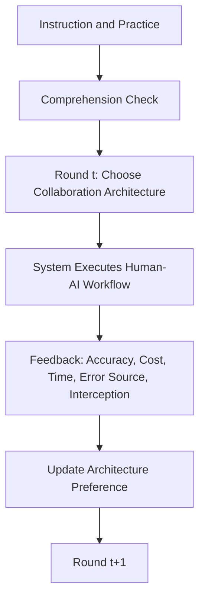

# Agent B 交付件：实验设计与模型方法

## 一、任务定位

本交付件对应原计划中的 `Agent B：实验设计与模型方法 Agent`。目标是把 Agent A 提出的理论问题转化为一个能够真正检验“路径依赖—收敛—稳定状态”的实验与模型系统。

核心原则只有一句话：

> 研究对象不是某一轮是否采纳 AI 建议，而是多轮反馈下人机协作架构如何被学习、被更新、被锁定。

---

## 二、研究类型

本研究应界定为：

```text
以实验操控为基础的动态因果机制研究
```

之所以不是描述性研究，也不是普通实验研究，是因为本文不仅要观察参与者选择了什么架构，还要通过操控错误分布路径来识别：

1. AI 与 human error 是否被不同权重地学习；
2. early AI error 是否会因果性地改变长期授权路径；
3. 参与者是否最终收敛到某种稳定状态；
4. 该稳定状态是否偏离客观最优架构。

---

## 三、实验总体设计

### 1. 实验角色设定

参与者不直接扮演底层判断执行者，而扮演一个“决策系统监督者”或“流程设计者”。在每一轮开始时，参与者需要为下一项任务选择一种人机协作架构，然后系统依据该架构运行，并返回反馈。

这个设计有两个优点：

1. 它把研究层级抬到“架构选择”而不是“单次 advice 接受”。
2. 它允许研究者严格控制 AI 与 human analyst 的客观表现，使差异来自学习路径而非真实能力差异。

### 2. 任务场景建议

可采用以下任一高频重复性任务场景：

1. 内容审核
2. 风险筛查
3. 质量检测
4. 医疗初筛的抽象化版本
5. 信用/欺诈预警的抽象化版本

建议优先使用“抽象风控/审核”场景，因为它较容易同时包含：

- 正确 / 错误结果
- 时间成本
- 人工复核成本
- 错误代价
- override 逻辑

### 3. 轮次设置

建议主实验设置为 `80` 轮。

理由：

1. 少于 `60` 轮通常不足以观察稳定状态。
2. `80` 轮既能体现路径依赖，也不至于让被试疲劳过重。
3. 若预实验表明参与者很快进入稳态，可缩减到 `60`；若后期仍有高震荡，可扩展到 `100`。

---

## 四、协作架构操作化

本文将人机协作架构操作化为五个离散策略：

| 编码 | 架构名称 | 说明 | AI autonomy level |
|---|---|---|---:|
| 1 | Human-only | 人类分析员独立完成决策 | 1 |
| 2 | AI advice only | AI 仅给出建议，人类做最终决策 | 2 |
| 3 | AI recommendation + human confirmation | AI 给出推荐，人类必须确认 | 3 |
| 4 | AI default + human override | AI 默认执行，人类可推翻 | 4 |
| 5 | AI autonomous decision | AI 自主完成决策 | 5 |

后续分析中可将其视为：

1. 五分类选择变量
2. 有序授权水平变量
3. 连续化 `AI autonomy level`

---

## 五、关键识别前提

要让实验真正检验“学习偏差”而不是“技术本身更差”，必须满足以下前提：

### 前提一：AI 与 human 的长期准确率相同

例如：

```text
AI accuracy = 80%
Human accuracy = 80%
```

如果两者不相同，那么低 AI 授权可能只是理性反应，而不是非对称学习。

### 前提二：条件之间只改变错误分布，不改变长期均值

AI early error 条件和 AI late error 条件中，AI 的总体错误数应保持相同，只改变其在时间上的分布。

### 前提三：架构之间要有明确成本差异

例如：

- `Human-only`：时间成本高
- `AI autonomous`：效率高但完全依赖 AI
- `AI + human confirmation`：安全性更高但复核成本大

否则，参与者就缺乏调整架构的实际激励。

### 前提四：反馈必须可见且可比较

每轮反馈至少包含：

1. 正确 / 错误
2. 收益 / 损失
3. 时间成本
4. 复核成本
5. 错误是否被拦截
6. AI 与 human 的表现来源

---

## 六、实验条件设计

### 条件 1：AI Early Error

AI 在早期若干关键轮次中出现明显错误，但整体准确率与 human 相同。

**理论目的**  
检验早期 AI error 是否触发低授权路径依赖。

### 条件 2：Human Early Error

human analyst 在早期出现同规模错误，AI 长期准确率与其相同。

**理论目的**  
检验人类错误是否会同等推动参与者提高 AI 授权。

### 条件 3：Evenly Distributed Errors

AI 与 human 的错误在整个实验中均匀分布。

**理论目的**  
作为基准路径，观察在没有明显前期冲击时，参与者是否更接近客观最优架构。

### 条件 4：AI Late Error

AI 的错误集中在后期而非前期。

**理论目的**  
检验 early error 与 late error 的路径依赖强弱差异。

### 条件设计表

| 条件 | 前期错误 | 后期错误 | 长期平均准确率 | 核心识别点 |
|---|---|---|---|---|
| AI Early Error | AI 高 | AI 低 | 与 human 相同 | 早期 AI 冲击是否改变路径 |
| Human Early Error | Human 高 | Human 低 | 与 AI 相同 | 人类错误是否对称推动授权迁移 |
| Evenly Distributed Errors | 均匀 | 均匀 | 双方相同 | 基准收敛路径 |
| AI Late Error | AI 低 | AI 高 | 与 human 相同 | 时点本身是否关键 |

---

## 七、实验流程



### 每轮操作步骤

1. 显示当前任务和当前可选架构。
2. 参与者选择一种协作架构。
3. 系统依据该架构运行。
4. 返回本轮表现反馈。
5. 进入下一轮。

### 反馈展示建议

每轮反馈建议采用固定格式，避免认知噪声：

```text
本轮结果：正确 / 错误
本轮收益：+X / -X
时间成本：X 秒
复核成本：X 点
错误来源：AI / Human
错误是否被拦截：是 / 否
```

---

## 八、核心假设与可检验形式

| 假设编号 | 假设内容 | 可检验形式 |
|---|---|---|
| H1 | AI error 引发更强负向架构更新 | `α_AI^- > α_Human^-` |
| H2 | 早期 AI error 降低长期 AI autonomy | AI Early Error 条件下后期 autonomy 更低 |
| H3 | AI 正确的恢复效应弱于 AI 错误的破坏效应 | `|α_AI^-| > |α_AI^+|` |
| H4 | human early error 不会对称推动高 AI autonomy | Human Early Error 条件下 autonomy 提升较弱 |
| H5 | 参与者可能收敛到非最优低授权状态 | 最终稳定架构偏离客观最优架构 |

---

## 九、因变量设计

### 主因变量

| 因变量 | 操作定义 |
|---|---|
| 最终收敛架构 | 后期轮次中选择比例最高的架构 |
| AI autonomy level | 将五种架构编码为 1–5 后的授权水平 |
| 是否进入低 AI 授权稳态 | 后期持续停留在低 autonomy 区间 |
| 收敛速度 | 达到稳态前所需轮数 |
| 恢复速度 | 从 AI error 冲击后恢复较高 autonomy 的速度 |
| 选择震荡程度 | 后期架构选择的方差或切换频率 |
| 非最优锁定程度 | 稳定架构与客观最优架构的偏离 |

### 辅助因变量

1. 每轮切换概率
2. 参与者对各架构的主观偏好评分
3. 对 AI 和 human 的主观可靠性感知
4. 对当前系统配置的满意度

辅助因变量不是核心，但可用于解释机制。

---

## 十、稳定状态定义

建议采用四条并行标准：

1. 最后 `15` 轮中某一架构选择比例超过 `70%`；
2. 最后 `15` 轮 `AI autonomy level` 方差低于预设阈值；
3. 后期选择概率不再随轮次显著变化；
4. 结构模型估计的 attraction 进入相对稳定区间。

如果其中三条及以上满足，可判定为 `behavioral steady state`。

---

## 十一、客观最优架构的设定

若要检验“非最优锁定”，必须先明确何为客观最优。建议在实验前构建统一效用函数：

```text
Expected Utility
= Correct Decision Bonus
- Error Penalty
- Time Cost
- Human Review Cost
```

在参数设定上，可令：

1. `AI autonomous`：效率最高但错误一旦发生代价大
2. `Human-only`：最安全但成本最高
3. `AI default + human override`：在平均条件下成为长期客观最优

这样，如果参与者因 early AI error 最终稳定停留在 `Human-only` 或 `AI advice only`，就可以解释为**偏离客观最优的低授权锁定**。

---

## 十二、EWA-inspired 模型

### 1. 模型定位

EWA 在本文中的作用不是“最后拿来拟合一下”，而是整个机制的形式化表达。它要解释的是：

1. 各协作架构的吸引力如何随反馈改变；
2. AI error 和 human error 是否具有不同 learning weight；
3. 早期冲击如何改变长期收敛路径。

### 2. 形式化表达

令 `k ∈ {1,2,3,4,5}` 表示五类协作架构，`A_{k,t}` 表示第 `t` 轮后架构 `k` 的吸引力，`s_t` 为参与者在第 `t` 轮的选择，则：

```text
N_t = ρN_{t-1} + 1

A_{k,t}
= [φN_{t-1}A_{k,t-1}
 + [δ + (1-δ)I(s_t = k)]U_{k,t}] / N_t

P(s_{t+1}=k)
= exp(βA_{k,t}) / Σ_j exp(βA_{j,t})
```

其中：

- `ρ`：经验权重衰减
- `φ`：历史 attraction 保留强度
- `δ`：反事实学习权重
- `β`：选择敏感度

### 3. 即时效用分解

为检验 AI 与 human error 的非对称学习，可把 `U_{k,t}` 写为：

```text
U_{k,t}
= α_AI^+ * I(AI correct)
+ α_AI^- * I(AI error)
+ α_Human^+ * I(Human correct)
+ α_Human^- * I(Human error)
- c_t
```

其中 `c_t` 表示时间、复核和风险成本。

### 4. 关键参数解释

| 参数 | 含义 | 理论解释 |
|---|---|---|
| `α_AI^-` | AI error 后的负向学习率 | 越大说明 AI error 被更强惩罚 |
| `α_Human^-` | human error 后的负向学习率 | 用于与 AI error 比较 |
| `α_AI^+` | AI correct 后的正向恢复率 | 测试修复效应 |
| `α_Human^+` | human correct 后的正向学习率 | 参照项 |
| `β` | 选择敏感度 | 越高说明更稳定选择高 attraction 架构 |
| `δ` | 反事实学习权重 | 越高说明会从未选架构的结果中学习 |

关键检验是：

```text
α_AI^- > α_Human^-
|α_AI^-| > |α_AI^+|
```

---

## 十三、分析计划

### 第一层：描述性轨迹分析

主要做四类图：

1. 各条件下平均 `AI autonomy level` 随轮次变化图
2. 各架构选择比例演化图
3. 切换频率与震荡程度图
4. 后期稳态分布图

### 第二层：因果识别分析

使用混合效应模型或 GEE 模型：

```text
Autonomy_it = Condition_i + Round_t + Condition_i × Round_t + Controls + u_i + e_it
```

重点关注：

1. `AI Early Error × Late Rounds`
2. `AI Early Error` 与 `AI Late Error` 的差异
3. `Human Early Error` 是否带来对称上升效应

### 第三层：结构估计分析

使用层级贝叶斯或最大似然估计 EWA 参数，比较条件之间：

1. `α_AI^-`
2. `α_Human^-`
3. `α_AI^+`
4. `β`
5. `δ`

这样可以直接把行为差异解释为 learning weight 差异。

---

## 十四、稳健性检验建议

1. 更换稳态阈值，例如 `70%` 改为 `65%` 或 `75%`。
2. 更换后期窗口，例如最后 `10`、`15`、`20` 轮。
3. 更换客观最优架构的成本参数设定。
4. 在补充实验中更换任务场景，验证外部效度。
5. 检验是否存在对 AI 的先验偏见调节效应。

---

## 十五、Agent B 完成结果摘要

本交付件已经完成原计划对 Agent B 的主要要求：

1. 已明确研究类型。
2. 已设计五类协作架构。
3. 已设计 4 个实验条件。
4. 已明确主因变量与稳态定义。
5. 已构建 EWA-inspired 模型。
6. 已形成分层分析计划与稳健性建议。

---

## 参考文献

1. Camerer, C., & Ho, T.-H. (1999). *Experience-Weighted Attraction Learning in Normal Form Games*. *Econometrica, 67*(4), 827-874. [https://onlinelibrary.wiley.com/doi/10.1111/1468-0262.00054](https://onlinelibrary.wiley.com/doi/10.1111/1468-0262.00054)
2. Mozannar, H., & Sontag, D. (2020). *Consistent Estimators for Learning to Defer to an Expert*. *PMLR 119*, 7076-7087. [https://proceedings.mlr.press/v119/mozannar20b.html](https://proceedings.mlr.press/v119/mozannar20b.html)
3. Lee, J. D., & See, K. A. (2004). *Trust in Automation: Designing for Appropriate Reliance*. *Human Factors, 46*(1), 50-80. [https://journals.sagepub.com/doi/10.1518/hfes.46.1.50_30392](https://journals.sagepub.com/doi/10.1518/hfes.46.1.50_30392)
4. Dietvorst, B. J., Simmons, J. P., & Massey, C. (2015). *Algorithm Aversion: People Erroneously Avoid Algorithms After Seeing Them Err*. *Journal of Experimental Psychology: General, 144*(1), 114-126. [https://pubmed.ncbi.nlm.nih.gov/25401381/](https://pubmed.ncbi.nlm.nih.gov/25401381/)
