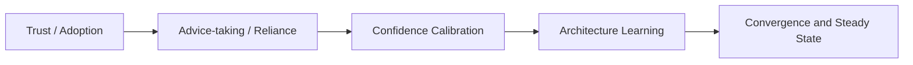
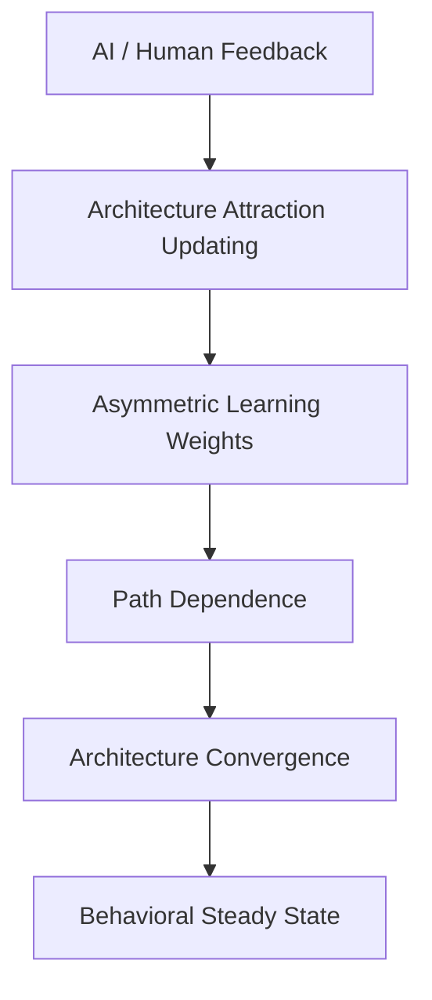
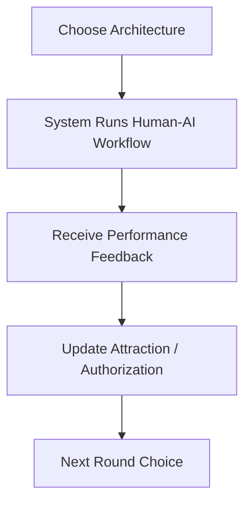
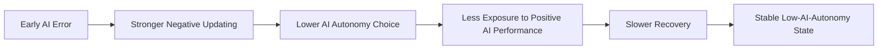

# Agent C 交付件：整合、可视化与审核

## 一、任务定位

本交付件对应原计划中的 `Agent C：整合、可视化与审核 Agent`。它的任务不是再提出新理论，而是把 Agent A 和 Agent B 的结果整合成一个可汇报、可写作、可展示的 proposal 交付包，并对逻辑风险做预审。

---

## 二、整合版 proposal 摘要

本研究关注一个典型但尚未被充分回答的问题：在持续反馈环境中，人类如何学习 AI 应该在决策系统中扮演什么角色，并最终形成稳定的人机协作架构。与既有 trust、adoption、advice-taking 或 confidence calibration 文献不同，本文不把 AI 看作一个是否被单次采纳的建议来源，而把它视为一个需要被制度化配置的位置变量。本文的核心主张是，AI error 的关键后果不是短期信任下降，而是通过更强的负向架构更新改变长期收敛路径，使人类可能路径依赖式地停留在低 AI 授权的稳定状态之中。

为检验这一机制，本文采用多轮行为实验与 EWA-inspired 动态学习模型。参与者在约 80 轮任务中为系统选择五类不同的人机协作架构之一，并根据 AI 与 human analyst 的反馈不断调整授权边界。实验通过操控 AI early error、human early error、evenly distributed errors 和 AI late error，同时保持 AI 与 human 的长期平均准确率一致，以识别错误来源与错误时点如何影响架构 attraction、路径依赖和最终稳定状态。本文预计证明：即使 AI 与 human 的长期客观表现相同，早期 AI error 仍可能导致人类收敛到非最优的低授权协作结构。

---

## 三、图示交付

### 1. 文献转向图

### 2. 理论机制图

### 3. 实验流程图

### 4. 预期收敛路径图

---

## 四、PPT 大纲

### 第 1 页：标题页

- 研究题目
- 作者与汇报信息

### 第 2 页：现实背景

- AI 正在进入高风险决策流程
- 问题从“是否使用”变成“如何配置角色”

### 第 3 页：文献现状

- trust / adoption
- advice-taking / reliance
- confidence calibration

### 第 4 页：研究缺口

- 现有研究少有长期架构学习视角
- 缺乏路径依赖与收敛机制解释

### 第 5 页：研究问题

- 人类如何学习 AI 在系统中的角色？
- AI error 是否改变长期授权路径？

### 第 6 页：理论框架

- repeated feedback
- attraction updating
- path dependence
- convergence
- steady state

### 第 7 页：实验设计

- 参与者角色
- 五类协作架构
- 80 轮重复任务

### 第 8 页：条件操控

- AI early error
- human early error
- evenly distributed errors
- AI late error

### 第 9 页：因变量与稳态判定

- 最终架构
- autonomy level
- 收敛速度
- 稳定状态标准

### 第 10 页：模型方法

- EWA-inspired 更新逻辑
- 关键参数
- 非对称学习率检验

### 第 11 页：预期贡献

- 理论贡献
- 方法贡献
- AI 治理贡献

### 第 12 页：风险与下一步

- 逻辑边界
- 预实验
- 正式实验实施安排

---

## 五、逻辑风险审核报告

### 风险 1：写成 AI trust 研究

**问题表现**  
如果论文核心句子变成“AI error 会不会降低 trust”，项目就会退回成熟文献。

**审核意见**  
全文应持续使用“架构学习”“长期授权”“收敛路径”“稳定状态”等措辞。

### 风险 2：写成单次 advice-taking 研究

**问题表现**  
如果研究重点落在某一次是否采纳 AI suggestion，项目会失去长期动态价值。

**审核意见**  
主因变量必须是后期稳定架构、AI autonomy level、收敛速度和恢复速度，而不是单次采纳率。

### 风险 3：与 confidence calibration 混淆

**问题表现**  
如果文章大量讨论 confidence signal，本研究会从 role learning 滑向 signal learning。

**审核意见**  
置信度可在未来扩展研究中使用，但不应作为本研究主操控。

### 风险 4：误用 equilibrium

**问题表现**  
直接写 Nash equilibrium 会引发理论不严谨。

**审核意见**  
应统一使用：

1. behavioral steady state
2. learning equilibrium
3. architecture convergence
4. stable collaboration pattern

### 风险 5：EWA 变成装饰

**问题表现**  
如果 EWA 只出现在模型一节，理论主线会断裂。

**审核意见**  
EWA 必须贯穿：

1. 研究问题
2. 理论机制
3. 实验设计
4. 参数解释
5. 收敛结果讨论

### 风险 6：实验轮次太少

**问题表现**  
少于 60 轮时，很难研究收敛与路径依赖。

**审核意见**  
主实验建议 80 轮，预实验再校准。

### 风险 7：AI 与 human 表现不可比

**问题表现**  
若 AI 的客观表现更差，低授权结果就不必然说明存在学习偏差。

**审核意见**  
必须程序化控制长期基础准确率相同。

---

## 六、修改建议

如果后续还要继续完善，我建议优先往下做这三步：

1. 把任务场景具体化为一个导师更容易理解的版本，例如“内容审核”或“风控审核”。
2. 把效用函数参数写得更细，例如正确奖励、错误惩罚、时间成本和复核成本的具体数值。
3. 做一版更正式的“开题报告体例”文稿，按学校常见格式拆成背景、文献、假设、方法、进度安排和参考文献。

---

## 七、Agent C 完成结果摘要

本交付件已经完成原计划对 Agent C 的主要要求：

1. 已形成整合摘要。
2. 已绘制文献转向图、理论机制图、实验流程图和预期收敛路径图。
3. 已输出 12 页 PPT 大纲。
4. 已完成逻辑风险审核与修改建议。
