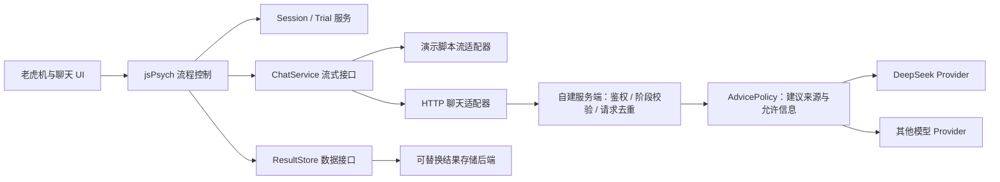

# 老虎机与 AI 聊天界面升级方案

日期：2026-09-18。状态：**PROPOSED，待实施**。依据：用户对当前 `preview.html` 的体验反馈。当前可运行基线仍为 0.3.0；本文不修改已冻结接口、研究参数或现有页面。

目标：让参与者实际操作三台老虎机，并在一个接近日常聊天助手的界面中请求、阅读 AI 建议。交付应能演示完整动作过程，不能只提交截图或带动画的选择题。

## 1. 需求与设计边界

| 项目                                     | 状态                  | 本轮定义                                                        |
| ---------------------------------------- | --------------------- | --------------------------------------------------------------- |
| 可操作的老虎机                           | FIXED：用户要求       | 可辨认的机柜、转轮、按钮、启动与停轮过程、开奖结果              |
| 高仿真聊天界面                           | FIXED：用户要求       | 参照 ChatGPT 或 Claude 的页面结构和交互细节，不再用普通建议卡片 |
| 逐步出现的回答                           | FIXED：用户要求       | 等待、首段出现、持续输出、结束、停止与错误状态                  |
| 未来接 DeepSeek 等模型                   | FIXED：用户要求       | 提供独立模型适配接口，替换模型不重写老虎机与聊天组件            |
| jsPsych / TypeScript / 可替换后端        | FIXED：既有要求       | 保留当前工程结构与施工规范                                      |
| 三台机器、每轮唯一中奖者                 | PROVISIONAL           | 沿用演示配置；正式结果生成方式仍按 DECISIONS 待定项处理         |
| GPT 风格浅色聊天布局                     | PROVISIONAL：建议默认 | 首版集中实现一种完整风格；Claude 风格作为后续样式配置           |
| 可自由追问的范围                         | PROVISIONAL           | 首版标准化提问；保留有限追问与自由对话扩展接口                  |
| 正式模型身份、信息来源、准确率与反馈安排 | TBD                   | 界面实现不能代替研究决定                                        |

任务仍是“预测下一轮实际中奖的机器”。当前“自己”与“AI”的选择不自动代表“人类总体”与“AI”的正式比较；来源选择、正确率与 alpha 继续分别记录和解释。高仿真是本次产品要求，本文不将其新增为理论构念或实验操纵。

## 2. 参与者将看到什么

### 2.1 主界面：三台机器组成一个操作台

建议采用深石墨色机柜、暖白转轮窗口、低饱和金属边框；页面其余区域保持简洁。三台机器外观尺寸一致，只以 A/B/C 标签区分。历史表现信息保留在机器下方，口径与材料配置一致。

```text
┌────────────────── 第 n 轮 · 当前积分 ──────────────────┐
│  预测本轮实际中奖的机器                                 │
│                                                       │
│   ┌──机器 A──┐   ┌──机器 B──┐   ┌──机器 C──┐            │
│   │ 转轮窗口 │   │ 转轮窗口 │   │ 转轮窗口 │            │
│   │ 图案图案 │   │ 图案图案 │   │ 图案图案 │            │
│   │ 选择 A   │   │ 选择 B   │   │ 选择 C   │            │
│   └──────────┘   └──────────┘   └──────────┘            │
│   历史信息 A     历史信息 B     历史信息 C               │
│                                                       │
│   当前预测：B      信心 [────────●──]                   │
│                   [ 确认本次预测 ]                     │
└───────────────────────────────────────────────────────┘
```

这是布局说明，不作为最终视觉稿。必须另外交付可点击的精细页面。

每个机柜包含顶部铭牌、带内阴影的转轮窗、统一 SVG 图案、底部物理感按钮及状态灯。用 CSS/SVG 和浏览器动画实现，首版不增加 3D 引擎。图标不用跨设备外观不一致的 emoji 充当最终素材。

| 动作               | 屏幕反馈                              | 必须保持的规则                       |
| ------------------ | ------------------------------------- | ------------------------------------ |
| 指向/触摸机器      | 按钮压下、边框与文字状态变化          | 选中不等于已提交；颜色之外有明确文字 |
| 提交独立预测       | 预测锁定，进入来源选择                | 不提前启动转轮或显示结果             |
| 提交最终预测       | 显示“预测已确认”，出现统一开奖控制    | 保存确认后才能推进                   |
| 按“开始开奖”或拉杆 | 三台转轮启动、模糊滚动、减速停轮      | 拉杆只是启动展示，不改变获奖概率     |
| 转轮停止           | 获奖机器亮灯，其余机器显示未中奖      | 机器中奖与参与者预测正确分开显示     |
| 看反馈             | “本轮中奖 C / 你的预测 B / 本轮得分…” | 继续按真实中奖者评分                 |

每台机柜内部可有三个小转轮，三个相同标记表示该机器中奖；必须在练习中说明“三台机柜才是三个预测对象”。具体停轮图案由同一个结果映射生成，不另设图案概率、投注额或赔付规则。

演示建议：启动反馈约 100–150 ms，转轮总展示约 1.8–2.4 秒；这些是待试用的工程参数。各机器和各条件使用相同动画规则，同时完成最终结果揭示。不得用不同停轮时间暗示哪台会赢，也不增加“差一点中奖”的特殊图案安排。结果先由实验服务确定，动画仅展示结果；重复点按、刷新、停止动画均不得重新抽奖或重复计分。

默认静音，声音可选且记录状态；支持减少动态效果。正式实验是否开放声音由协议决定。奖励文字与灯光强度保持一致，不根据建议来自谁改变庆祝效果。

### 2.2 桌面与手机

- 桌面常规阶段显示完整操作台。选择 AI 后打开独立的聊天工作区：宽屏可并排保留机器摘要与聊天，较窄屏幕进入全幅聊天页。聊天内容区建议 640–760 px，避免像右下角客服小窗。
- 手机保留三台机器同时可见的简化机柜和独立点击区，最小触控区 44 px；不通过横向滑动隐藏某台机器。选择 AI 后进入全屏聊天层，顶部可返回本轮，底部输入框随软键盘调整。
- 聊天收起再打开，保留同一会话、已显示文字、滚动位置和运行状态；不是每次点击重新生成。浏览器刷新恢复另由 C 的持久化任务实现。
- 机器区有完整版本和小屏版本，但显示同样的材料与选择；不能因屏幕小省略概率或反馈。

## 3. 聊天界面应如何仿真

### 3.1 统一参照与视觉交付

建议先做 GPT 风格：浅色背景、紧凑顶栏、窄幅会话内容、右侧用户消息、左侧助手正文、底部圆角输入框、发送箭头和生成时的停止方块。Claude 风格可以以后通过背景、字体、留白与输入框样式切换；首版不同时拼接两套产品特征。

实施第一步必须冻结一份带日期的参照图及桌面/手机关键状态稿，记录布局、字号、边距、图标和滚动行为，再进入组件开发。参照可来自公开产品资料或专门演示会话，不采集私人聊天。本文不声称已经完成参照截图核验或当前产品的逐像素复刻。

界面使用统一的研究助手名称。布局仿真、底层模型、向被试说明的来源身份分别配置；不能因为采用 GPT 风格就把脚本或 DeepSeek 回答标成“GPT 实际预测”。演示页继续明确模拟；正式来源说明和可能涉及的实验告知，沿用研究协议另行确定。

首版必须包含：

1. **会话入口**：选择 AI 后进入聊天页，顶部显示助手名称和本轮会话；桌面可有可折叠会话栏，手机为返回按钮。
2. **真实发送动作**：输入框预填“请给出你对本轮中奖机器的预测。”，参与者点击发送后才产生用户消息。原型默认标准化提问，输入框明确显示当前模式。
3. **会话正文**：用户消息靠右，助手段落靠左；显示顺序、换行、粗体和段落间距自然，不把每句回答塞进表单卡片。
4. **生成过程**：发送后进入等待状态；正文逐段增长；发送键变停止键；结束后恢复可用操作，提供复制按钮。
5. **继续实验**：回答结束后出现页面外层的“返回本轮并确认预测”，聊天回答本身不代替参与者选择机器。
6. **连贯操作**：自动滚动只在用户接近底部时发生；用户向上翻阅时显示回到底部按钮。收起聊天不取消生成，明确点击停止才取消。

不为装饰添加不能工作的登录、上传、语音、联网搜索和模型切换按钮。允许存在的按钮均应有真实、可测试的行为。限制重生成和历史会话访问时，使用清楚的实验模式说明，不能做成无反馈的假按钮。

### 3.2 对话开放程度

| 模式           | 行为                                                   | 建议用途                           |
| -------------- | ------------------------------------------------------ | ---------------------------------- |
| `standardized` | 标准问题 + 固定版本回答；可以停止、继续阅读、复制      | 首轮高仿真原型的默认模式           |
| `bounded`      | 可选择预设追问，例如重述建议；回答范围与次数受配置限制 | 后续经确定的实验配置               |
| `open`         | 可输入自由文本，经真实模型生成回复                     | 接入和可用性探索；单独记录运行模式 |

三种模式共用聊天组件。自由输入可作为下一阶段开发能力，但不能把无法回答任意问题的脚本界面包装成自由对话。桌面自由输入模式支持 Enter 发送、Shift+Enter 换行；中文输入法候选确认时不能误发消息。

回答长度、额外理由、历史信息与可追问次数可能改变参与者接收到的证据。默认回答材料应经 D 统一版本化；仿真首版不自行添加“我经过复杂分析”等表述，也不显示编造的思考过程。

## 4. 流式输出与真实模型接口

### 4.1 同一个显示组件，两种数据来源



模型接入与结果保存是两个独立接口。将来更换 JATOS、自建数据库或导出方式，不必重写聊天；更换 DeepSeek 也不应改变数据保存协议。

演示适配器从已获授权的固定材料生成文字片段，推荐按少量汉字/短语分批输出，并在句段边界短暂停顿。初始体验参数可设首段等待 300–700 ms、每批 1–4 个可见字符、间隔 30–90 ms，再按实际可读性调整。节奏必须可固定、可复现，不由目标机器或建议对错决定。这里是演示播放参数，不是真实网络性能承诺。

真实模式由服务端接收供应商流，转换为统一事件，再让浏览器消费。DeepSeek 官方 Chat Completions 文档提供 `stream: true` 的 SSE 增量输出；供应商报文需要由适配器处理，不能直接写进 UI。[DeepSeek 官方接口](https://api-docs.deepseek.com/api/create-chat-completion/)

Claude 官方流包含消息开始、内容增量、消息停止等事件。这与 DeepSeek 的报文结构不同，因此统一接口应表达“开始/文字增量/完成/错误”，不照抄某一家格式。[Claude 官方流式文档](https://platform.claude.com/docs/en/build-with-claude/streaming)

### 4.2 建议的接口草案

以下为新契约候选，**不是 0.3.0 已有类型**。由 A 审核、补运行时校验、冻结兼容与迁移方案后再供 B/C 使用。

```typescript
type ChatStreamEvent =
  | { type: 'started'; requestId: string; messageId: string }
  | { type: 'text_delta'; requestId: string; sequence: number; text: string }
  | { type: 'completed'; requestId: string; messageId: string; contentHash: string }
  | { type: 'cancelled'; requestId: string; lastSequence: number }
  | { type: 'failed'; requestId: string; code: string; retryable: boolean };

interface ChatRequest {
  sessionId: string;
  trialId: string;
  adviceId: string;
  requestId: string;
  userText: string;
}

interface ChatService {
  streamReply(request: ChatRequest, signal: AbortSignal): AsyncIterable<ChatStreamEvent>;
}
```

来源、模型 ID、提示词/回答材料版本、运行模式和生成参数写入服务端审计记录，并通过允许公开的元数据返回。请求中的 ID 不能代替鉴权；服务端验证会话归属、试次阶段、发送次数和可用上下文。模型密钥只在服务器环境中，不出现在浏览器包或 Git。

`AdvicePolicy` 单独决定本轮建议的来源和目标。需要区分：

- **固定建议**：机器 ID 与文本来自版本化材料，适合精确控制建议正确率的原型。
- **模型辅助措辞**：机器 ID 已确定，模型只改写表达。生成结果须验证未改变目标或添加额外信息；建议在采集前批量生成、审核和冻结，再流式播放。
- **真实模型预测**：模型仅获得协议允许的开奖前信息，输出预测后锁定；其正确率要根据随后实际结果计算，不能预先承诺达到指定水平。

如果中奖事件没有可预测信号，接入真实模型不会自动带来目标正确率。严禁通过将未来开奖结果传给模型来冒充预测。模型是否拥有额外有效信号，是正式实验材料问题，接口只预留。

### 4.3 流的边界行为

- 正式数据必须按许可时点才提供；不能把完整建议或未来结果预载到隐藏 DOM。当前演示浏览器含材料这一限制继续明确标记。
- 分块可能截断 UTF-8 字符或 SSE 事件，解析器必须缓冲；显示层按完整可见字符更新，批量绘制，避免频繁重排。
- 首版只渲染安全文本与受限 Markdown，不执行模型或用户内容中的 HTML、脚本和外部资源。
- 请求结束须有明确完成事件；断线、超时、限流和输出长度上限不能被当作成功结束。
- 停止后保留可见前缀并记录，不瞬间补齐全文。“继续读取”应恢复同一回答；重试复用请求 ID，不能无提示生成另一条建议。真实流恢复依赖服务端缓冲，未实现时明确报告无法继续。
- 脚本模式与真实模式不得在故障时静默互换；需要回退时作为新的运行状态显式记录。

## 5. 实验流程和数据要同步调整

建议演示路径：

```text
观察机器 → 独立预测与信心 → 来源选择
  ├─ 自己：进入最终预测
  └─ AI：进入聊天 → 发送 → 流式回答完成 → 返回机器
→ 最终预测确认与保存 → 启动开奖 → 停轮 → 反馈 → 下一轮
```

沿用当前演示的先选来源再看建议；正式阶段顺序仍由配置与研究方案确定。若未来比较外部人类建议与 AI 建议，两者的窗口、等待、字数和可操作范围需按研究目的统一或明确设为条件，不能让 UI 改版无意中改变比较对象。

当前 `loadAdvice` 一次返回全文，`advice_revealed` 也不能完整表达逐步可见过程。新方案要求 A 增补流式读取与呈现事件；UI-only 演示可在已合法取得文本后分片，但不可据此声称正式服务器流式接口完成。

拟新增原始记录：

| 记录                                               | 用途                                       |
| -------------------------------------------------- | ------------------------------------------ |
| 界面版本、运行模式、设备与参与方式                 | 区分界面/网络/现场配置；设备不替代参与方式 |
| 聊天打开、请求发送、首段绘制、服务端完成、全文绘制 | 分离等待、传输与可见时间                   |
| request/message/advice ID、材料/模型版本           | 将同一次输出关联到建议、试次与来源         |
| 已显示片段或可重建文本、序号与时间                 | 判断停止或断线前参与者实际看到什么         |
| 停止、失败、恢复、重试、页面不可见                 | 识别不完整暴露和技术中断                   |
| 最终选择按钮可用时点、最终预测提交                 | 计算完整建议呈现后的操作时长               |
| 开奖启动、动画完成、反馈实际可见                   | 区分结果确定与动画/反馈呈现                |

记录中的时间单位为毫秒。同一页面时长使用单调时钟，客户端与服务器时钟不能直接相减；另存墙钟时间用于关联。记录 schema、材料和界面版本，不能只保留“正确/错误”汇总。

原型建议完整回答显示后允许最终提交。停止时可以继续读取或退出，不强行补全文；允许在部分回答后继续作答的模式需单独配置与记录。来源选择反应时、等待时长、阅读时长、最终预测反应时分开，不能合成一个笼统反应时。

新增日志仍通过 `ResultStore.saveEvents`，沿用回执、幂等和 `memory/browser_local/remote` 区分。原始文本与事件应能通过 message ID 和内容哈希核对；真实模型运行还需要保存安全处理后的供应商完成状态。建议不能仅保存 hash 而丢失实际内容，也不必逐 token 向结果服务器单独发请求，可按批次保存。

本轮 UI 完成不等于第二项解释性实验已设计完成，也不等于 alpha 已可识别；这些继续留在研究待定事项中。

## 6. 文件结构与 Agent 施工安排

所有新增目录均为建议位置，按当前职责表落实。保持 TypeScript + jsPsych + Vite + HTML/CSS，不另起前端框架。

```text
src/
  ui/
    slot/             # B：机柜、转轮、开奖控制、结果呈现
    chat/             # B：会话布局、输入框、消息流、滚动与状态
    styles/           # B：统一 token、桌面/手机样式
  experiment/         # B：jsPsych 插件与阶段控制
  contracts/          # A：聊天事件、服务接口、校验与版本迁移
  adapters/
    chat-scripted/    # C：固定材料的模拟流
    chat-http/        # C：统一 HTTP 流适配器
  domain/             # D：中奖结果与图案映射、建议规则
  bootstrap.ts        # A：注入聊天/实验/结果适配器
server/
  chat/               # C：权限、请求去重、恢复缓冲与调用入口
  providers/          # C：DeepSeek 等供应商协议转换
materials/chat/       # D：已审核的标准问题、建议和有限追问
config/               # D：版本化模式与呈现参数；A 协调 schema
tests/                # 各 owner 沿既有测试目录分工
```

| 阶段              | Owner / 依赖                     | 可检查的交付物                                            |
| ----------------- | -------------------------------- | --------------------------------------------------------- |
| U0 设计与接口冻结 | A 协调，B 视觉，D 材料；串行对齐 | 桌面/手机关键状态稿、参照图、状态表、流接口候选与迁移说明 |
| U1 视觉交互原型   | B；U0 后                         | 可操作机柜、真实停轮、完整聊天布局；旧 preview 保留供回归 |
| U2 脚本流与材料   | C/D；与 U1 使用同一 fixture 并行 | 可复现增量流、取消/错误/恢复示例、结果与图案一致          |
| U3 实验集成       | A/B/C；U1/U2 后                  | jsPsych 阶段连接、保存回执、全流程事件导出                |
| U4 独立验收       | Q；集成后                        | 截图与录像、交互/故障检查、数据重算报告                   |
| U5 真实模型接入   | C/A；以后单独派发                | DeepSeek 服务端适配、凭证配置说明、真实流验证与局限       |

近期优先交付 **U0–U2 的可见体验**，随后 U3 接完整实验。U1/U2 通过不代表已具备正式采集能力。U5 的接口在 U0 定义，实际 API 调用可后置，避免视觉完成受模型凭证阻塞。

本方案不自动启动任何 agent。后续 A 明确派发后，B 独占 UI，C 独占模型适配与服务端，D 独占材料/映射；公共类型、锁文件和入口由 A 管理。每个阶段按施工指南保存 `handoffs/<角色>/LATEST.md`，额度不足时交付当前文件、截图、可运行命令、失败和下一步，不能只留下描述。

## 7. 验收标准

### 可见体验

- 参与者能直接辨认三台老虎机；选择、锁定、启动、停轮、中奖反馈有连续动作与明确状态。
- 聊天具有完整的会话页面、输入区、用户消息、助手回答、生成/停止行为；不能以“增加一个机器人图标”验收。
- 桌面 1440 px、窄桌面 1024 px、手机 390 px 和 360 px 均交截图；手机软键盘、滚动和返回需另做真机检查，模拟视口不替代真机。
- 至少提交：待预测、选中、转轮运行、开奖结果、聊天空态、生成中、生成完成、停止/失败八种状态。录制一次完整路径，以验证动画和流式过程。
- 参照图与实现截图对照检查布局、字体、间距、图标、输入区和消息出现方式；不能仅凭测试通过声称高仿真完成。

### 功能与数据

- 同一材料在旧/新 UI 下得到相同独立预测、建议目标、最终预测和评分；保留“历史概率最高 A、本轮中奖 C”的反例。
- 同一结果不会因快速双击、动画中断或重复请求变更；一次试次只计分一次。
- 流式解析覆盖跨字节字符、跨事件网络块、重复片段、正常结束、截断、停止和断线；错误不得误报为完整建议。
- 检查最后一个片段已绘制才开放后续按钮；收起聊天、切换标签页或向上滚动不丢消息、不重复提交。
- 核查原始导出能重建参与者已看到的回答和顺序；保存失败不能显示已上传。
- jsPsych 使用自定义插件承载这些组件；避免在 jsPsych 外另建无法统一导出的正式流程。
- 自动检查沿用类型检查、lint、相关 Vitest、构建与 Playwright；真实模型未接入、真机未测、远程保存未实现时分别报告。

## 8. 当前实施建议

先完成一轮精细的老虎机 + GPT 风格聊天 + 固定回答流式输出，交付可点击页面与过程录像。让用户看到具体机柜、聊天版式和动作节奏后，再进入多题实验与真实模型接入。

首版建议保持标准化提问、固定材料、同一聊天风格；预留自由对话和真实 DeepSeek Provider。这样界面体验、材料控制和模型替换可以分别验收。正式结果生成、人类比较对象、来源说明与对话自由度继续按研究决定处理，工程 agent 不替用户定稿。
