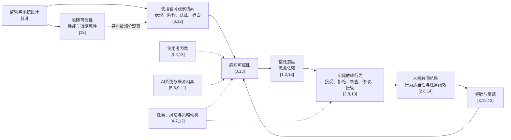

# AI信任研究背景与整体架构：逐句引证讨论稿

> 文档性质：可批注讨论稿  
> 所属项目：第二篇——AI授权 / 重复反馈中的依赖校准  
> 当前版本：v0.2  
> 日期：2026-07-31  
> 引用规则：所有外部事实、概念定义和文献判断均在句末标注参考文献编号。  
> 归纳规则：并非由某篇论文直接提出、而是由多篇文献综合得出的判断，统一标为“本文归纳”。  
> 项目规则：有关当前论文取舍的内容统一标为“项目待定”，不冒充既有文献结论。

## 一、结论先行

AI信任研究的核心对象不是使用者是否喜欢AI，也不只是使用者是否愿意采用AI，而是使用者在不确定性和风险条件下如何判断AI是否值得依赖，以及这种判断如何转化为实际依赖行为。[2,13]

AI信任并不是一套单一理论，而是由人际信任、自动化信任、人机交互、机器人信任和AI伦理等研究共同构成的跨学科研究领域。[1-8,13]

现有元分析主要回答哪些使用者因素、系统因素和情境因素能够提高或降低信任，但尚未充分回答这种信任是否由AI的真实能力和实际可信性所支持。[4-7]

Kaplan等明确指出，其元分析研究了信任的前因，却没有检验这种信任是否“有根据”，而且性能指标只能作为实际可信性的代理，不能与实际可信性画等号。[6]

Everett等进一步指出，实际可信性、感知可信性、信任态度和信任行为是相互关联但可以分离的概念。[13]

因此，AI信任研究正在从“如何提高信任”转向“信任是否有根据、依赖是否适当，以及二者如何在持续互动中得到调整”。[2,7,8,12,13]

对于以决策行为为因变量的研究，最终结果变量应当是依赖行为及其适当性，而不是笼统的“AI使用率”或单一信任问卷得分。[2,8,13,14]

## 二、文献表一：经典理论与整合框架

| 文献 | 文献性质 | 核心概念 | 对AI信任研究的作用 | 使用边界 |
| --- | --- | --- | --- | --- |
| Mayer, Davis, and Schoorman（1995）[1] | 组织信任理论模型。[1] | 信任是信任者在不能控制对方的情况下，愿意使自己暴露于对方行动影响的意愿；被信任者的可信性包括能力、善意和正直。[1] | 为AI信任研究提供“风险/脆弱性”和“能力—善意—正直”的基础结构。[1,7,8,13] | 原模型研究的是人与组织关系，不能未经论证地把AI等同于具有真实善意和意图的人类行动者。[1,13] |
| Lee and See（2004）[2] | 自动化信任理论综述与概念模型。[2] | 信任在复杂性和不可预期性使使用者无法完全理解系统时引导依赖；研究目标是形成适当依赖。[2] | 提供“系统特征—信任—依赖”主干，并把研究目标从提高信任改为改善依赖。[2] | 该框架主要形成于传统自动化研究，应用于生成式AI时需要考虑AI的社会性、开放输出和持续变化。[6,13] |
| Hoff and Bashir（2015）[3] | 系统综述与三层自动化信任模型，纳入101篇论文中的127项研究。[3] | 自动化信任的差异来源被分为倾向性信任、情境性信任和学习形成的信任。[3] | 将稳定个体差异、当前情境和交互经验放入同一模型，为初始信任与后续更新的区分提供依据。[3] | 该模型能够说明信任的来源层次，但不直接规定使用者如何根据逐轮信息更新依赖权重。[3,12] |
| Mehrotra等（2024）[8] | 关于appropriate trust的系统综述。[8] | 该文区分belief、intention和action，并区分appropriate trust、calibrated trust、warranted trust和reliance。[8] | 为确定因变量属于信念、意愿还是行为提供概念工具。[8] | 该文整理的是概念与方法，不是对某一种干预措施效果大小的元分析。[8] |
| Everett等（2026）[13] | Nature Reviews Psychology概念综述，不是元分析。[13] | 该文提出六项原则：信任是推断形成的；实际可信性、感知可信性、信任和行为不同；信任同时涉及性能与道德；信任具有系统特异性、个体差异和策略动机。[13] | 为元分析结果提供上位概念地图，并把性能、道德、系统、个体、情境和动机放入同一结构。[13] | 六项原则是组织领域的概念框架，不等于六个已经得到因果验证的机制。[13] |

## 三、文献表二：核心元分析与系统综述

| 文献 | 研究对象与证据规模 | 主要分类 | 作者报告的主要结果 | 作者承认的限制或未来方向 |
| --- | --- | --- | --- | --- |
| Schaefer等（2016）[4] | 自动化信任元分析；30项研究提供164个组间效应量，16项研究提供63个相关效应量。[4] | 使用者相关因素、自动化相关因素和环境因素。[4] | 所有因素的总体组间效应为中等水平，使用者和自动化相关因素均表现出调节效应，而环境因素数量不足以计算稳定结果。[4] | 作者将沟通方式、自动化水平、拟人化、反馈和其他证据不足的因素列为需要继续积累研究的领域。[4] |
| Hancock等（2021）[5] | 机器人信任元分析；45篇文献提供252个效应量，其中164个为相关效应量、88个为实验效应量。[5] | 使用者因素、机器人因素和情境因素；其下进一步区分能力/特征、性能/属性和协作/任务。[5] | 组间比较显示使用者、机器人和情境三类前因都会影响信任；机器人可靠性、任务难度、接近程度、文化、经验和拟人化在相应分析中表现出显著影响。[5] | 大量具体因素只有少数研究支撑，部分结果会被个别研究过度影响；作者同时要求进一步研究团队、工作流程和提高信任与任务绩效之间的关系。[5] |
| Kaplan等（2023）[6] | AI信任元分析；65篇文献提供294个效应量。[6] | 人类信任者、AI被信任者和共同情境；AI因素进一步区分性能与属性。[6] | 三类总体因素以及可靠性、拟人化等多个具体前因都能够预测AI信任，而且部分前因与AI真实性能没有直接关系。[6] | 该元分析没有检验信任是否有根据；性能前因只是实际可信性的代理；大量变量和变量交互仍缺少足够研究。[6] |
| McKenna等（2024）[7] | 脆弱性与人机信任元分析；21项研究提供36个效应量。[7] | 作者将脆弱性区分为性能不确定性、物理风险、隐私风险和其他关系性风险类别。[7] | 当使用者必须依赖机器人完成任务且无法确定其能力时，性能不确定性是预测信任的重要类别。[7] | 作者提出需要加强跨文化研究、真实风险场景研究以及对威胁和脆弱性的客观测量。[7] |
| Mehrotra等（2024）[8] | appropriate trust系统综述，依据PRISMA程序梳理定义、测量、任务和干预方法。[8] | Beliefs、Intentions和Actions三类测量对象，以及透明度、认知、模型/指南和关系性方法等研究路径。[8] | 现有文献对appropriate trust及其相邻概念的定义和测量并不一致。[8] | 作者提出需要区分能力、正直和善意，区分信念、意愿和行为，并加强持续互动与真实场景验证。[8] |
| Vaccaro、Almaatouq和Malone（2024）[14] | 人机协作绩效系统综述与元分析；106项实验提供370个效应量。[14] | 人机协同相对于最佳单方的synergy，以及相对于人类单独决策的augmentation。[14] | 人机组合平均优于人类单独工作，但平均劣于人类或AI中的最佳单方；决策任务出现平均绩效损失，创造任务与之存在显著差异。[14] | 该研究测量的是人机共同绩效而不是信任；其结果说明提高使用或增加AI参与不能自动推出更优的人机结果。[14] |
| Everett等（2026）[13] | 跨心理学、哲学、行为经济学、人机交互和AI伦理的概念综述。[13] | 推断性、概念分离、多维性、系统特异性、个体差异和策略动机六项原则。[13] | AI信任不是静态、单维和脱离情境的态度，而是会随系统、个人、文化、情境和动机变化的判断。[13] | 作者要求未来研究考察六项原则之间的交互、性能信任与道德信任的分离、策略动机、纵向变化以及更广泛的社会政治背景。[13] |

## 四、文献表三：算法厌恶、算法欣赏与动态调整

| 文献 | 研究问题 | 作者报告的发现 | 对整体架构的意义 | 不能支持的结论 |
| --- | --- | --- | --- | --- |
| Dietvorst、Simmons和Massey（2015）[9] | 人们在看到算法犯错后是否减少对算法的选择。[9] | 三项实验表明，看到算法表现的参与者更少选择算法，即使他们看到算法整体优于人类预测者。[9] | 该研究表明，错误暴露可以改变算法来源的后续权重。[9] | 该研究不能单独证明所有AI错误都会导致持久的依赖不足，也不能证明这种反应在所有任务和多轮环境中都存在。[9,12] |
| Dietvorst、Simmons和Massey（2018）[10] | 给予使用者少量修改算法预测的权力能否减少算法厌恶。[10] | 三项研究表明，即使修改幅度受到严格限制，允许修改也会提高参与者选择不完美算法的可能性。[10] | 该研究表明，控制权安排会改变算法依赖，而依赖不只由性能决定。[10] | 该研究不能说明允许修改一定改善依赖校准，因为提高算法使用和提高适当依赖不是同一个结果。[2,8,10] |
| Logg、Minson和Moore（2019）[11] | 当建议被标记为算法或人类来源时，普通参与者是否给予不同权重。[11] | 六项实验表明，普通参与者在若干判断任务中对算法建议的依从程度高于对人类建议的依从程度。[11] | 该研究表明，算法来源在某些情境中可以产生算法欣赏而不是算法厌恶。[11] | 该研究不能证明人们普遍偏好算法，因为其结果受比较对象、任务和使用者经验等边界条件限制。[11] |
| de Visser等（2020）[12] | 如何从纵向角度解释人机团队中的信任形成、失调、降低与修复。[12] | 该文提出一个纵向整合模型，把交互经验、关系状态、工作协议、透明度和信任修复纳入持续的人机关系。[12] | 该文为“反馈以后如何调整信任”提供理论框架，并明确把过度信任的降低与信任不足的修复视为不同干预目标。[12] | 该文是理论模型与研究议程，不是已经估计出统一动态参数的元分析。[12] |
| Camerer和Ho（1999）[15] | 如何用统一形式模型描述博弈中的强化学习与信念学习。[15] | EWA使用历史吸引力、经验权重和收益反馈更新策略选择，并把强化学习与加权虚拟博弈作为特殊情形。[15] | 本文归纳：EWA可以作为反复选择中权重更新的形式化工具，但它不是AI信任理论，也不能替代对信任、可信性和依赖的概念定义。[2,8,12,15] | EWA原始模型研究标准式博弈中的策略学习，不能在没有重新定义状态、选择和反馈的情况下直接套用于AI依赖。[15] |

## 五、三组容易混淆但必须分开的概念

### 5.1 实际可信性、感知可信性、信任与行为

实际可信性指AI客观上是否具有使其值得信任的属性，而感知可信性指使用者对这些属性的主观判断。[13]

Everett等将实际可信性视为客观属性，将感知可信性视为主观属性，将信任视为愿意依赖的态度，并将trusting behaviour视为实际行为。[13]

AI具有提高实际可信性的技术或制度属性，并不保证使用者能够正确感知这些属性。[13]

使用者认为AI值得信任，也不证明AI实际上值得信任。[13]

信任态度可能不转化为使用行为，使用行为也可能发生在使用者口头上表示不信任AI的情况下。[13]

### 5.2 性能信任与道德信任

性能信任回答AI是否有能力可靠地完成任务，道德信任回答AI或其背后的开发和治理过程是否遵守规范、诚实并避免伤害。[13]

高能力AI可能具有欺骗性或不符合伦理，而符合伦理目标的AI也可能缺乏完成任务的能力。[13]

现有AI信任量表经常把性能项目和道德项目混入同一个总分，导致不同维度的作用难以区分。[13]

因此，只用准确率解释AI信任不足以覆盖AI信任的全部含义。[7,8,13]

对于当前以建议正确性和依赖行为为核心的研究，可以把性能可信性作为明确限定的研究维度，但不能把它写成完整的AI可信性。[6,8,13]

### 5.3 Appropriate trust、calibrated trust与appropriate reliance

Mehrotra等将appropriate trust界定为使用者关于AI可信性的信念与AI实际可信性相匹配的状态。[8]

Mehrotra等将calibrated trust界定为在反复互动中纠正过度信任和信任不足的动态过程，并把appropriate trust视为这一过程在多次互动中维持的状态。[8]

Lee和See将appropriate reliance置于行为层面，强调人在系统适合被依赖的情境中依赖系统，而在系统不适合被依赖时拒绝或接管系统。[2]

因此，appropriate trust主要判断信念是否正确，calibrated trust主要判断信念是否经过动态调整，而appropriate reliance主要判断实际行为是否合适。[2,8]

本文归纳：如果研究记录的是接受建议、拒绝建议、修改建议或给予建议的权重，那么直接因变量属于reliance，而不是trust本身。[2,8,13]

本文归纳：如果研究进一步比较依赖行为与AI逐题或逐任务的真实表现，才可以讨论appropriate reliance或明确操作化后的reliance calibration。[2,8,14]

## 六、研究的整体架构

### 6.1 前因层

元分析通常把信任前因分为使用者、系统和共同情境三类。[4-6]

使用者层包括倾向、经验、能力和人口或文化差异；系统层包括性能、可靠性、属性和拟人化；情境层包括任务、风险、协作和互动安排。[3-7]

这些前因可以影响感知可信性和信任水平，但前因能够提高信任不等于它能够提高适当信任。[6,8]

### 6.2 心理判断层

使用者并不能直接读取AI的实际可信性，而是根据系统表现、解释、外观、来源标签和制度信号推断AI是否值得信任。[6,13]

这种推断可以同时包含对性能和道德的判断，而且不同使用者可能给予这些维度不同权重。[13]

### 6.3 行为层

信任态度之后可能出现接受、拒绝、核查、修改、授权或接管等不同依赖行为。[2,8,13]

只测量是否使用AI会把这些行为压缩成单一结果，并无法区分过度依赖、依赖不足和适当依赖。[2,8]

### 6.4 结果层

行为结果至少包括依赖是否适当以及人机组合是否改善任务绩效两个不同问题。[2,8,14]

Vaccaro等发现人机组合平均优于人类单独工作，但平均没有超过人类或AI中的最佳单方，说明更多AI参与不能自动推出人机协同。[14]

### 6.5 动态层

信任会随着交互经验、成功、错误和系统变化而调整，因而初始信任与学习形成的信任应当分开研究。[3,12,13]

纵向信任研究同时关注过度信任的降低和信任不足的修复，而不是把所有变化都解释为“信任增加”。[12]

### 6.6 制度层

监管可以通过安全要求、审计和责任约束影响AI的实际可信性，也可以通过认证、披露和标签影响使用者能够观察到的可信性线索。[13]

Everett等明确警告，认证或“可信AI”标签可能被用于制造不应有的信任，因此合规或获得认证不能自动等同于获得了合理信任。[13]

目前列入本稿的元分析没有直接估计监管、认证或审计对信任校准的平均因果效应。[4-7]

因此，把监管作为校准干预属于有理论依据但尚未得到元分析验证的新研究延伸，而不是成熟结论。[6,8,13]

## 七、现有研究的主要分支

| 分支 | 核心问题 | 常见因变量 | 主要文献基础 | 当前主要缺口 |
| --- | --- | --- | --- | --- |
| 信任前因 | 哪些人、系统和情境因素影响信任。[3-6] | 信任问卷、感知可靠性和感知可信性。[3-6,13] | Hoff and Bashir；Schaefer；Hancock；Kaplan。[3-6] | 能预测信任水平，但经常不能判断信任是否有根据。[6,8] |
| 来源依赖评价 | 同样或相近的建议被标记为算法或人类时，是否得到不同权重。[9,11] | 来源选择、建议权重和预测采纳。[9-11] | 算法厌恶与算法欣赏研究。[9-11] | 不同研究可以出现相反方向，说明来源效应不是无条件固定偏好。[9,11] |
| 依赖行为 | 信任如何转化为接受、拒绝、授权、核查或接管。[2,8,13] | 实际使用、建议采纳、修改、核查和接管。[2,8,13] | 自动化信任与BIA概念框架。[2,8] | 许多研究仍把行为压缩成单一使用率。[8] |
| 适当信任与适当依赖 | 使用者信念和行为是否与AI实际可信性相匹配。[2,8] | 信念—可信性差距、适当同意、适当拒绝和任务结果。[8] | Lee and See；Mehrotra等。[2,8] | 定义、参照标准和测量方法仍不统一。[8] |
| 动态校准 | 使用者如何根据错误、成功和系统变化调整后续信任与依赖。[3,12,13] | 多轮信任、依赖权重、错误后的下降和修复。[3,12] | Hoff and Bashir；de Visser等；Everett等。[3,12,13] | 横截面和一次性实验仍多，长期变化和真实互动证据不足。[8,12,13] |
| 人机共同绩效 | 人机组合是否优于人类或AI单独行动。[14] | 准确率、质量、损失、augmentation和synergy。[14] | Vaccaro等元分析。[14] | 绩效差异不能仅由信任水平解释，任务类型、相对能力和分工同样重要。[14] |
| 制度与治理 | 监管信息是否帮助使用者识别AI能力和局限。[13] | 感知可信性、信任、依赖和校准结果。[8,13] | Everett等的治理含义和appropriate trust综述。[8,13] | 监管效果尚缺少直接元分析证据，认证也可能诱发不合理信任。[13] |

## 八、基于原文的未来研究方向

| 方向 | 原文依据 | 证据状态 |
| --- | --- | --- |
| 从信任高低转向信任是否有根据 | Kaplan等明确指出其分析没有检验信任是否有根据，性能前因也只是实际可信性的代理。[6] | 元分析作者直接提出的缺口。[6] |
| 分开研究性能信任与道德信任 | Everett等要求研究二者独立甚至相互冲突的作用。[13] | 概念综述直接提出的方向。[13] |
| 研究多种线索之间的交互 | Kaplan等指出前因之间的交互缺少研究，Everett等要求研究六项原则之间的交互。[6,13] | 元分析与概念综述共同支持的方向。[6,13] |
| 从问卷信任转向实际依赖与共同绩效 | Everett等区分态度与行为，Mehrotra等区分belief、intention和action，Vaccaro等直接测量人机共同绩效。[8,13,14] | 多类综述共同支持的方向。[8,13,14] |
| 从一次性判断转向纵向调整 | Hoff and Bashir区分学习形成的信任，de Visser等提出纵向校准模型，Everett等要求采用纵向和发展性方法。[3,12,13] | 系统综述、理论模型和概念综述共同支持的方向。[3,12,13] |
| 从总体AI态度转向具体系统和任务 | Everett等强调信任具有系统特异性，Kaplan等发现不同AI形态可能具有不同前因结构。[6,13] | 元分析与概念综述共同支持的方向。[6,13] |
| 研究监管能否改善而不是操纵信任 | Everett等认为监管应承认系统局限并促进适当信任，同时警告认证标签可能制造不应有的信任。[13] | 概念综述直接提出治理问题，但尚无元分析效果结论。[4-7,13] |

## 九、对当前第二篇研究的定位

本文归纳：算法厌恶和算法欣赏最适合放在“来源和错误线索如何改变依赖”的现象层，而不适合作为覆盖整篇研究的总理论。[9-11]

本文归纳：自动化信任理论和appropriate trust框架可以提供“可信性—信任—依赖”的理论主干。[2,3,8,13]

本文归纳：如果当前研究关注错误反馈以后如何调整建议权重，直接研究对象应写成动态依赖或依赖调整，而不能仅凭行为数据声称测得了内在信任。[2,8,12,13]

本文归纳：de Visser等的纵向信任校准模型可以为动态过程提供信任理论依据，而EWA只能作为描述历史经验如何进入下一轮选择的候选形式模型。[12,15]

本文归纳：只有在研究同时建立AI真实能力的逐题或逐任务参照时，才可以进一步判断依赖调整究竟改善还是损害了appropriate reliance。[2,8,14]

项目待定：监管可以保留为单独的研究延伸或现实意义，但是否取代“重复反馈中的动态依赖”成为第二篇的主线，不能由现有综述自动决定。

## 十、需要你确认的修改问题

1. 项目待定：是否接受把“trust”“calibrated trust”和“appropriate reliance”严格区分。
2. 项目待定：第二篇的直接因变量究竟是依赖权重、建议采纳、授权，还是信任问卷。
3. 项目待定：第二篇是否必须设置AI真实能力参照，从而能够识别过度依赖与依赖不足。
4. 项目待定：算法厌恶与算法欣赏是否只作为来源效应文献，而不再被称为理论主干。
5. 项目待定：EWA是否只承担动态形式化作用，而不承担AI信任理论作用。
6. 项目待定：监管是独立研究问题、边界条件，还是仅作为研究意义。
7. 项目待定：是否还需要补充医疗、自动驾驶或其他具体领域的信任元分析；如果补充，必须先确定研究领域，不能把不同任务直接混合。

## 十一、修改记录

| 版本 | 日期 | 修改内容 | 修改依据 |
| --- | --- | --- | --- |
| v0.1 | 2026-07-31 | 建立AI信任研究背景、概念关系和研究分支。 | 当前讨论。 |
| v0.2 | 2026-07-31 | 补入经典理论表、元分析表、算法厌恶/欣赏与动态研究表；将外部判断改为逐句引用；区分appropriate trust、calibrated trust和appropriate reliance。 | 用户修改意见与参考文献[1-15]。 |

## 参考文献

[1] Mayer, R. C., Davis, J. H., & Schoorman, F. D. (1995). An integrative model of organizational trust. *Academy of Management Review, 20*(3), 709–734. https://doi.org/10.5465/amr.1995.9508080335 · [中文总结](./Paper2_EWA_参考文献导航.md#mayer1995) · [官方原文](https://doi.org/10.5465/amr.1995.9508080335)

[2] Lee, J. D., & See, K. A. (2004). Trust in automation: Designing for appropriate reliance. *Human Factors, 46*(1), 50–80. https://doi.org/10.1518/hfes.46.1.50_30392 · [中文总结](./Paper2_EWA_参考文献导航.md#leesee2004) · [官方原文](https://doi.org/10.1518/hfes.46.1.50_30392)

[3] Hoff, K. A., & Bashir, M. (2015). Trust in automation: Integrating empirical evidence on factors that influence trust. *Human Factors, 57*(3), 407–434. https://doi.org/10.1177/0018720814547570 · [中文总结](./Paper2_EWA_参考文献导航.md#hoff2015) · [官方原文](https://doi.org/10.1177/0018720814547570)

[4] Schaefer, K. E., Chen, J. Y. C., Szalma, J. L., & Hancock, P. A. (2016). A meta-analysis of factors influencing the development of trust in automation: Implications for understanding autonomy in future systems. *Human Factors, 58*(3), 377–400. https://doi.org/10.1177/0018720816634228 · [中文总结](./Paper2_EWA_参考文献导航.md#schaefer2016) · [官方原文](https://doi.org/10.1177/0018720816634228)

[5] Hancock, P. A., Kessler, T. T., Kaplan, A. D., Brill, J. C., & Szalma, J. L. (2021). Evolving trust in robots: Specification through sequential and comparative meta-analyses. *Human Factors, 63*(7), 1196–1229. https://doi.org/10.1177/0018720820922080 · [中文总结](./Paper2_EWA_参考文献导航.md#hancock2021) · [官方原文](https://doi.org/10.1177/0018720820922080)

[6] Kaplan, A. D., Kessler, T. T., Brill, J. C., & Hancock, P. A. (2023). Trust in artificial intelligence: Meta-analytic findings. *Human Factors, 65*(2), 337–359. https://doi.org/10.1177/00187208211013988 · [中文总结](./Paper2_EWA_参考文献导航.md#kaplan2023) · [官方原文](https://doi.org/10.1177/00187208211013988)

[7] McKenna, P. E., Ahmad, M. I., Maisva, T., Nesset, B., Lohan, K., & Hastie, H. (2024). A meta-analysis of vulnerability and trust in human–robot interaction. *ACM Transactions on Human-Robot Interaction, 13*(3), Article 42, 1–25. https://doi.org/10.1145/3658897 · [中文总结](./Paper2_EWA_参考文献导航.md#mckenna2024) · [官方原文](https://doi.org/10.1145/3658897)

[8] Mehrotra, S., Degachi, C., Vereschak, O., Jonker, C. M., & Tielman, M. L. (2024). A systematic review on fostering appropriate trust in human-AI interaction: Trends, opportunities and challenges. *ACM Journal on Responsible Computing, 1*(4), Article 26, 1–45. https://doi.org/10.1145/3696449 · [中文总结](./Paper2_EWA_参考文献导航.md#mehrotra2024) · [官方原文](https://doi.org/10.1145/3696449)

[9] Dietvorst, B. J., Simmons, J. P., & Massey, C. (2015). Algorithm aversion: People erroneously avoid algorithms after seeing them err. *Journal of Experimental Psychology: General, 144*(1), 114–126. https://doi.org/10.1037/xge0000033 · [中文总结](./Paper2_EWA_参考文献导航.md#dietvorst2015) · [本地原文](../../../defense_project/reference_materials/papers_originals/paper2_ewa/Dietvorst2015.pdf)

[10] Dietvorst, B. J., Simmons, J. P., & Massey, C. (2018). Overcoming algorithm aversion: People will use imperfect algorithms if they can (even slightly) modify them. *Management Science, 64*(3), 1155–1170. https://doi.org/10.1287/mnsc.2016.2643 · [中文总结](./Paper2_EWA_参考文献导航.md#dietvorst2018) · [本地原文](../../../defense_project/reference_materials/papers_originals/paper2_ewa/Dietvorst2018.pdf)

[11] Logg, J. M., Minson, J. A., & Moore, D. A. (2019). Algorithm appreciation: People prefer algorithmic to human judgment. *Organizational Behavior and Human Decision Processes, 151*, 90–103. https://doi.org/10.1016/j.obhdp.2018.12.005 · [中文总结](./Paper2_EWA_参考文献导航.md#logg2019) · [本地原文](../../../defense_project/reference_materials/papers_originals/paper2_ewa/Logg2019.pdf)

[12] de Visser, E. J., Peeters, M. M. M., Jung, M. F., Kohn, S., Shaw, T. H., Pak, R., & Neerincx, M. A. (2020). Towards a theory of longitudinal trust calibration in human–robot teams. *International Journal of Social Robotics, 12*(2), 459–478. https://doi.org/10.1007/s12369-019-00596-x · [中文总结](./Paper2_EWA_参考文献导航.md#devisser2020) · [官方原文](https://doi.org/10.1007/s12369-019-00596-x)

[13] Everett, J. A. C., Claessens, S., Knöchel, T.-D., & Reinecke, M. G. (2026). Principles for understanding trust in artificial intelligence. *Nature Reviews Psychology, 5*(6), 388–401. https://doi.org/10.1038/s44159-026-00562-1 · [中文总结](./Paper2_EWA_参考文献导航.md#everett2026) · [官方原文](https://doi.org/10.1038/s44159-026-00562-1)

[14] Vaccaro, M., Almaatouq, A., & Malone, T. (2024). When combinations of humans and AI are useful: A systematic review and meta-analysis. *Nature Human Behaviour, 8*, 2293–2303. https://doi.org/10.1038/s41562-024-02024-1 · [中文总结](./Paper2_EWA_参考文献导航.md#vaccaro2024) · [官方原文](https://doi.org/10.1038/s41562-024-02024-1)

[15] Camerer, C., & Ho, T.-H. (1999). Experience-weighted attraction learning in normal form games. *Econometrica, 67*(4), 827–874. https://doi.org/10.1111/1468-0262.00054 · [中文总结](./Paper2_EWA_参考文献导航.md#camerer1999) · [本地原文](../../../defense_project/reference_materials/papers_originals/paper2_ewa/Camerer1999.pdf)
